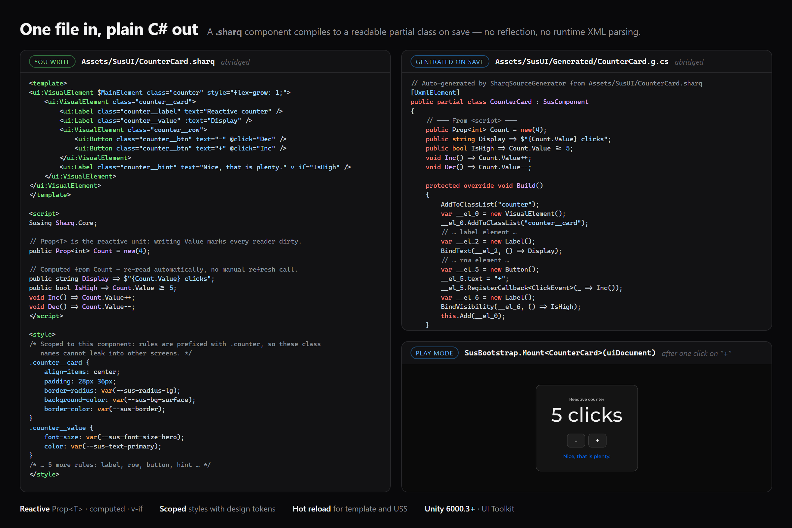

# 9. Compilation and generation



## Pipeline

```
Saving .sharq to Assets/
    │
    ▼ AssetPostprocessor.OnPostprocessAllAssets
    ├── SharqFileImporter.ProcessSharq()
    │   ├── SharqFileParser → SharqFileModel (template, script, style)
    │ ├── SharqSectionCache → incremental regeneration
    │ ├── SharqValidator → diagnostics (warnings)
    │   ├── BuildMethodGenerator → .g.cs
    │   ├── ScopedCssGenerator → _scoped.g.uss
    │   └── StyleParser → .g.uss (global)
    │
    ▼ Result:
        Assets/SusUI/Generated/ComponentName.g.cs
        Assets/SusUI/Generated/ComponentName_scoped.g.uss
        Assets/SusUI/Generated/ComponentName.g.uss (global)
```

## Incremental compilation

- **Content-hash**: if `.sharq` hasn't changed - skipped
- **Section-level**: if only `<style>` changed - only `.uss` is regenerated (hot reload without a C# domain reload)
- **SharqAutoRegenerate**: checks freshness on domain reload

## SharqValidator - diagnostics

| Check | Level |
|----------|---------|
| `v-for` without `:key` (when `StrictVForKey: true`) | Warning |
| Unused fields in `<script>` | Info |

## Generated files

```
Assets/SusUI/
├── Component.sharq ← source (you can edit here, in any subfolder)
├── Resources/SusRuntime/ ← author's runtime resources (in git): Icons/, Fonts/, theme-overrides
└── Generated/ ← auto-generated (.gitignored)
    ├── Component.g.cs
    ├── Component_scoped.g.uss
    ├── Component.g.uss
    ├── Component_static.g.uss
    ├── Component.sections.json
    ├── Component.sharq.hash
    ├── .gitignore
    └── Resources/SusRuntime/ ← synced USS components for runtime (auto)
```

> Base theme/icons/fonts (`_theme`, `_icon`, `_font`, `design-tokens`) ship inside the package
> itself: `sus-core/Runtime/Resources/SusRuntime/`. `SusRuntime` is a virtual Resources namespace
> (`Resources.Load("SusRuntime/..")`), not "compiler output"; Unity merges every
> `Resources/SusRuntime/` folder (package + project) into a single path.

**Important:** Always edit `.sharq`, never `Generated/*` - generated files get overwritten.

> **Cleanup:** deleting a `.sharq` file deletes all 6 generated files, its `.meta`, and any Resources copies automatically. Renaming deletes the old artifacts and creates new ones.

## Loading USS at runtime

Components load styles via `Resources/SusRuntime/` (in a build). The Editor has a fallback - if the file isn't found in Resources, it's loaded directly from `Generated/` through `AssetDatabase`.

## Batch pipeline (for library packages)

Besides the project-scoped importer (`Assets/SusUI`), there is a **declarative batch pipeline** -
for libraries that ship already-generated `.cs`/`.uss` inside the package itself
(optional downstream UI packages).

The package declares WHAT to generate in a descriptor, **`sharq.gen.json`** (next to `package.json`):

```json
{
  "displayName": "My UI Package",
  "sources":   ["Components"],
  "generated": "Runtime/Generated",
  "resources": "Runtime/Resources/SusRuntime",
  "watch": true,
  "namespace": "MyCompany.UI"
}
```

Optional **`namespace`**: a dotted C# identifier wrapped around every generated `.g.cs`
type for that package. Empty / omitted → global namespace (legacy). Downstream UI
packages should set this to their package root namespace so short type names don't
collide across packages.

Optional **`usings`**: a string array of extra C# namespaces emitted as `using` directives in every generated `.g.cs` file (when composing types from another UI package).

Infrastructure lives in `sus-core/Editor/Packaging/`:

- **`SusPackageRegistry`** - finds descriptors for all resolved packages; only mutable packages
  (`file:` links / embedded) are considered - registry/git packages already ship ready-made
  artifacts.
- **`SusPackageGenerator`** — menu **`Sharq/Generate All Packages`** (all packages at once) and
  window **`Sharq/Generate Package…`** (one at a time). Under the hood: `SharqBatchCompiler.CompileDirectory`
  (`sus-core/Editor/AssetPipeline/`), using the **same** `BuildMethodGenerator` as the importer.
- **`SusPackageAutoCompile`** — a FileSystemWatcher for each source directory of a package with
  `watch: true` (packages outside `Assets/` aren't visible to AssetPostprocessor): saving `.sharq` →
  auto-regeneration. **In Play mode:** style-only / template-only changes use `SharqBatchMode.HotReloadSafe`
  (USS + interpreter, without `.g.cs` / a domain reload); a `<script>` change defers until Play mode exits,
  then runs a full Generate. In Edit mode, it's always a full package Generate.
- The result is **committed to the package** (unlike the project-scoped `Generated/`, which is
  in `.gitignore`).

### Three generation pipelines

| Pipeline | Trigger | Scope | Who |
|---|---|---|---|
| Project | saving `.sharq` in `Assets/` (AssetPostprocessor) + `Window → SUS → Sharq → Regenerate All Prototype Components` | `sus.config.json` → `SharqDirectory` | `SharqFileImporter` |
| Packages | saving `.sharq` in the package (watcher) + freshness check on domain reload + menu | all packages with `sharq.gen.json` | `SusPackage*` (see above) |
| CLI | manual run / CI | `Assets/` without Unity (`.g.cs` only) | `SharqBootstrap` |

> A package consumer cannot rely on a runtime Roslyn source generator - so `.cs` is
> generated ahead of time and shipped in the package like regular scripts.

## How the generator translates the author's `.sharq` into C#

`BuildMethodGenerator` converts DSL syntax into valid C#:

| In `.sharq` | In `.g.cs` |
|---|---|
| `[CreateProperty(default:0)] public Prop<int> Damage = new(0);` | `[CreateProperty]` (the DSL parameters `default:`/`validate:` are discarded) plus the backing `public Prop<int> Damage = new(0);` and a companion property `public int damage { get => Damage.Value; set => Damage.Value = value; }` |
| `[CreateProperty]` present | auto `using Unity.Properties;` |
| Vue-style quotes in expressions: `v-if="Mode.Value != 'delete'"`, `!= ''` | C# quotes: `Mode.Value != "delete"`, `!= ""` |
| `$using System.Linq;` | `using System.Linq;` |

`using System;` and `using System.Collections.Generic;` are always added.

### Conventions for the `<script>` block

- `SusComponent : VisualElement` - **the root is the component itself**: use `this.Q<…>()`,
  `this.style`, `this.schedule` (not `Element.…`).
- Base lifecycle hooks: `Created()`, `BeforeMounted()`, `Mounted()`, `Updated()`,
  `BeforeUnmounted()`, `Unmounted()` (all `protected override void`). There is **no** `Init()` method -
  element setup (`this.Q<…>()`, `Watch(...)`) belongs in `Created()`.

## Hot reload (Editor + DEVELOPMENT_BUILD)

### USS (E1 / E4)

- Editing only `<style>` → regenerates `.g.uss` without a domain reload → `UssHotReloadService`
reloads companion sheets on live components (<1s in Editor Play).
- Remote (E4): `SusRuntimeHotReload.ApplyUss` + Runtime MCP `ui.hotreload.uss` /
  Session MCP `client.hotreload_uss`. StyleSheet-from-text goes via the Editor's
  `StyleSheetImporterImpl` (`SusUssFromString`). On a standalone player without the Editor factory,
  USS parsing isn't available; template hot reload still works.
- Editor push: `RemoteHotReloadPushService` (disable via EditorPrefs
  `Sharq.RemoteHotReload.Enabled` = 0).

### Templates (E3)

- Editing only `<template>` → `SharqCompileEvents.OnTemplateChanged` →
  `TemplateHotReloadService` / `SharqTemplateInterpreter.TryApply`.
- Remote: `ui.hotreload.template` / `client.hotreload_template`.

#### Template interpreter support matrix

| Feature | Status | Behavior |
|---|---|---|
| `$MainElement` / root attrs → `this` | ✅ | Like `BuildMethodGenerator`: class / `:class` / name apply to the host component, children go inside |
| `class`, `:class` (object), `name`, `:text` | ✅ | |
| `v-if` / `v-show` (literal, `!`, `==`/`!=`, `\|\|`/`&&`, `Prop.Value`) | ✅ | Complex C# (`string.IsNullOrEmpty`, method calls) → fallback |
| `Prop="lit"` / `:Prop="expr"` | ✅ | Simple strings/numbers/bool/enum |
| `<slot>` / named slot | ✅ | Via `GetSlotContainer` / `BuildSlot` |
| `@click` / `@*` events | ⚠️ skip | Logs `[SharqInterp] Skipping unsupported event…`; the tree applies without handlers |
| `transition=` on v-if | ⚠️ ignore | The attribute is skipped; the animation only appears after a full recompile |
| `v-for` | ❌ fallback | `TryApply` → false, needs a domain reload / full Build |
| Arbitrary nested C# expressions | ❌ fallback | |

Rule of thumb: simple downstream UI templates (Divider / Badge / a simplified Alert) get
`TryApply == true`; anything notoriously complex (`v-for`, heavy expressions) predictably
falls back with a warning.

### State-preserving domain reload (E2b)

When editing `<script>`, Unity performs a domain reload. To keep the UI from resetting:

1. **Edit → Preferences → General → Script Changes While Playing =
Recompile And Continue Playing** (otherwise Play mode stops). Without this preference,
   Unity stops Play mode on every script change - the snapshot mechanism below is moot.
2. `HotReloadStatePreserveService` snapshots `SusComponentSnapshot` for **UIDocument**
   and **EditorWindow** Sus-trees before the reload and restores them afterward via `delayCall`.
3. Primitive types plus **enum** `Prop<T>` values are serialized; other types are ignored.
4. Option in `Assets/sus.config.json`: `"HotReloadStatePreserve": true` (default).
   Turn it off with `false`.

> The "never recompile mid-match" rule still takes priority over a live PvP session -
> E2b is an Editor convenience, not a replacement for that rule.
