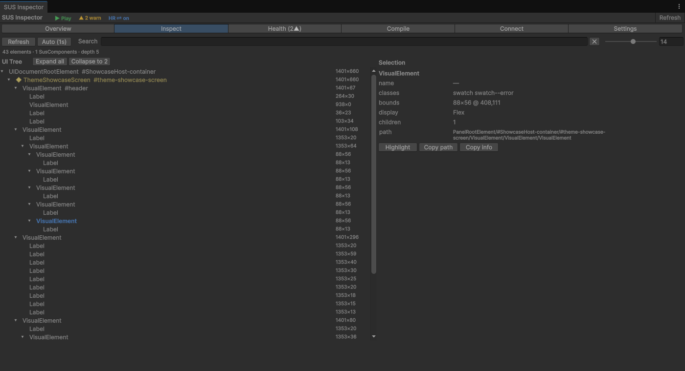

# SusAudit - built-in checks (Debug / QA)

> Automatic audit modules built into `sus-core` and `sus-router`.
> All of them are gated by `#if UNITY_EDITOR || DEVELOPMENT_BUILD`.
> In release builds they are fully stripped by the compiler - **zero runtime overhead**.



## Overview table

| # | Module | Where it's wired | Trigger | Automatic |
|---|--------|----------|---------|:---:|
| 1 | **ClickAudit** | `SusComponent` + `ClickAuditService` | Every `ClickEvent` on registered elements | ✅ |
| 2 | **BoundsAudit** | `SusComponent` constructor | 2 frames after mount | ✅ |
| 3 | **CallbackAudit** | `SusComponent.cs` methods + 16 `.sharq` | `ClickEvent` handler guard conditions / timing | ⚠️ `.sharq` | <!-- sus:ok local audit count -->
| 4 | **OverlayAudit** | `OverlayHost.AddToOverlay()` | Adding an element to the overlay | ✅ |
| 5 | **StateAudit** | `.sharq` (SusButton/Toggle/Dropdown/ListGroup/Modal) | `WatchEffect` on conflicting props | ⚠️ `.sharq` |
| 6 | **LifecycleAudit** | `SusComponent.OnDetachFromPanelHandler()` | Detach from panel | ✅ |
| 7 | **NavigationAudit** | `SusRouter.Push/Replace/PushNamed/ReplaceNamed` | `Resolve()` returned null | ✅ |
| 8 | **PerformanceAudit** | `SusComponent` constructor | 500ms after mount | ✅ |
| 9 | **DebounceAudit** | `SusComponent` constructor | Every `ClickEvent` on interactive elements | ✅ |
| 10 | **ClickTargetSizeAudit** | `SusComponent` constructor (combined with BoundsAudit) | 2 frames after mount | ✅ |
| 11 | **StackDepthAudit** | `SusRouter.PushRecord` | After `_history.Add()` | ✅ |
| 12 | **GuardAudit** | `SusRouter.Navigate()` | After `NavigateCore` - if the result is `Aborted` | ✅ |
| 13 | **ModalStackAudit** | `OverlayHost.AddToOverlay()` | Adding a modal to the overlay | ✅ |
| 14 | **EmptyStateAudit** | `.sharq` (SusListGroup/SusDropdown) | `Items.Count == 0` but the element is open/visible | ⚠️ `.sharq` |
| 15 | **RemountLoopAudit** | `SusComponent.OnAttachToPanelHandler()` | >5 attaches in 1 second | ✅ |
| 16 | **OverflowAudit** | `SusComponent` constructor | Children go beyond the parent's bounds (Unity does not clip) | ✅ |
| 17 | **DeadRouteAudit** | `SusRouter` (manual call `AuditUnusedRoutes()`) | Registered but never used routes | 🔧 manual |
| 18 | **SusTable StateAudit** | `.sharq` (SusTable) | `WatchEffect` - `ItemsPerPage > Items` or `Page > TotalPages` | ⚠️ `.sharq` |
| 19 | **LayoutReentryAudit** | `SusComponent.OnGeometryChangedForBreakpoint()` | >20 `GeometryChanged` events in 500ms | ✅ |
| 20 | **IdleGuardAudit** | `SusComponent` constructor | The element is visible for 30+ seconds without clicks | ✅ |
| 21 | **FocusTrapAudit** | `.sharq` (SusModal) | `FocusEvent` - Tab moves focus away from the modal | ⚠️ `.sharq` |

> ✅ = fully automatic, nothing to add to the component.
> ⚠️ = requires one line - `SetClickAuditDescription("Name")` or a `WatchEffect` in `.sharq` (already built into all components).
> 🔧 = manual method call.

---

## 1. ClickAudit - does the click reach the element

**Files:** `sus-core/Runtime/Diagnostics/ClickAuditService.cs`, `sus-core/Runtime/SusComponent.cs`

**Problem:** the element is registered as clickable, but when clicked the event doesn't reach it - it's intercepted by another element above it (tooltip, overlay, modal with the wrong `pickingMode`).

**How it works:**
- `ClickAuditService.Instance.Install(panel)` - called automatically on the first `SusBootstrap.Mount<T>()`.
- The service registers a global `ClickEvent` handler on `panel.visualTree`.
- On each click it compares `evt.target` with the registered elements.
- If the click doesn't hit any registered element, the intercepting element's layer is logged.

**Example warning:**
```
[ClickAudit] Active: 'SusButton' blocked at center. Reason: Covered by 'SusTooltip'
```

**Integration:** an element registers itself via `SetClickAuditDescription("Name")` in `Created()`. Already built into 16 downstream components <!-- sus:ok local audit count -->.

---

## 2. BoundsAudit - are the sizes non-zero

**File:** `sus-core/Runtime/SusComponent.cs` (constructor)

**Problem:** Unity UITK **doesn't call** `ContainsPoint` for elements with zero dimensions - the click passes through. Common causes:
- No `flexGrow`, `width`, `height` set in USS/styles
- The parent didn't allocate any size
- `display: none` / `visible: false`
- The element isn't attached to the panel yet

**How it works:** a delayed check via `schedule.Execute(...).StartingIn(150)` - waits 2-3 frames for layout to settle, then checks `worldBound.width` and `worldBound.height`.

**Example warning:**
```
[BoundsAudit] 'SusUnitCard' has zero bounds after mount (0×0).
  display=Flex, visible=True, pickingMode=Position.
  Clicks will NOT reach this element.
```

---

## 3. CallbackAudit - did OnClick actually run

**Files:** `sus-core/Runtime/SusComponent.cs`, 16 `.sharq` <!-- sus:ok local audit count -->

**Problem:** `ClickEvent` fires, the element is reachable, the click gets through - but the handler is NOT called. Common causes:
- `Disabled.Value = true` → handler returns early
- `Loading.Value = true` → handler returns early
- A guard condition: `if (someCondition) return;`
- The handler ran, but took > 50ms (suspiciously long)

**Two sub-modes:**

### 3a. Guard-lock (`AuditClickBlocked`)
```csharp
// In SusButton.sharq:
if (Disabled.Value)
{
    AuditClickBlocked("Disabled");  // ← warning to the console
    return;
}
```
Example: `[CallbackAudit] 'SusButton' click blocked: Disabled`

### 3b. Timing (`AuditClickStart` / `AuditClickEnd`)
```csharp
var t0 = AuditClickStart();
OnClick?.Invoke();
AuditClickEnd(t0);  // if > 50ms → warning
```
Example: `[CallbackAudit] 'SusButton' OnClick took 127.3ms`

**Wired into (16 `.sharq`):** `SusAlert`, `SusButton`, `SusDropdown`, `SusEmptyState`, `SusForm`, `SusLink`, `SusListGroup`, `SusMenuButton`, `SusNumberInput`, `SusPagination`, `SusRating`, `SusSnackbar`, `SusStepper`, `SusTabs`, `SusToggle`, `SusUnitCard`. <!-- sus:ok local audit count -->

---

## 4. OverlayAudit - UI overlap

**File:** `sus-core/Runtime/OverlayHost.cs`

**Problem:** when an element is added to `OverlayHost` (tooltip, dropdown, modal), it can intercept clicks meant for elements underneath via its own pickable children.

**How it works:** in `AddToOverlay()`, after the element is inserted, `Query<VisualElement>()` looks for any descendants with `pickingMode == Position`; if any are found (and the category isn't `Modal`) it warns.

**Example warning:**
```
[OverlayAudit] 'SusTooltip' added to overlay in Tooltip category
  with 3 pickable children. It may block clicks to underlying UI.
  Consider setting pickingMode=Ignore on children.
```

---

## 5. StateAudit - prop consistency

**Files:** `SusButton.sharq`, `SusToggle.sharq`, `SusDropdown.sharq`, `SusListGroup.sharq`, `SusModal.sharq`

**Problem:** inconsistent state combinations - `Disabled=true` and `Loading=true` at the same time (the spinner never shows), `IsOpen=true` while `Disabled=true` (dropdown open but inactive), `Selected` not present in `Items` (nothing highlighted), `Model=false` but the modal is still visible.

**How it works:** a `WatchEffect` inside each `.sharq` component watches the relevant prop combination.

| Component | Rule |
|-----------|---------|
| `SusButton` | `Disabled && Loading` → both true at the same time |
| `SusToggle` | `Disabled && Loading` → both true at the same time |
| `SusDropdown` | `IsOpen && Disabled` → open but disabled |
| `SusListGroup` | `Selected` not in `Items` → nothing highlighted |
| `SusModal` | `Model=false` but `display ≠ None` → hidden modal is still visible |

**Example warnings:**
```
[StateAudit] SusButton: both Disabled and Loading are true.
  Loading spinner will never be visible.

[StateAudit] SusDropdown: IsOpen=true while Disabled=true.
  Dropdown should close when disabled.

[StateAudit] SusListGroup: Selected value is not in Items.
  List will have no highlighted item.

[StateAudit] SusModal: Model=false but element is still visible
  (display=Flex). Modal should be hidden.
```

---

## 6. LifecycleAudit - subscription leaks

**File:** `sus-core/Runtime/SusComponent.cs` (`OnDetachFromPanelHandler`)

**Problem:** the element was removed from the panel, but its subscriptions to `Prop<T>.Changed` are still alive - a memory leak and a source of errors on remount.

**How it works:** on detach it records `_bindings.Count`; after 1 second it checks whether the panel is still null and the subscription count hasn't dropped → leak.

**Example warning:**
```
[LifecycleAudit] 'SusUnitCard' detached but 3 bindings were not disposed.
  Possible leak.
```

---

## 7. NavigationAudit - unresolved routes

**File:** `sus-router/Runtime/SusRouter.cs`

**Problem:** `SusRouter.Push("/settings")` is called but the path doesn't resolve (`Resolve` returns null) - the user presses the button and nothing happens.

**How it works:** each navigation method (`Push`, `Replace`, `PushNamed`, `ReplaceNamed`) warns if `record == null`.

**Example warning:**
```
[NavigationAudit] Push('/battle/unknown') — route not found.
```

---

## 8. PerformanceAudit - too many elements

**File:** `sus-core/Runtime/SusComponent.cs` (constructor)

**Problem:** a deep tree or too many children (>500 VisualElements) → slow `PickAll`, long layout passes, sluggish UI.

**How it works:** 500ms after mount, `Query<VisualElement>()` counts all elements in the subtree. If > 500 → warning.

**Example warning:**
```
[PerfAudit] 'SusTable' has 1423 VisualElements.
  Consider virtualization (SusTable) or paging.
```

---

## 9. DebounceAudit - double clicks

**File:** `sus-core/Runtime/SusComponent.cs` (constructor)

**Problem:** the user clicks a button twice quickly (< 300ms apart) - a double-submit becomes possible (two API calls, double currency deduction, etc.).

**How it works:** the `SusComponent` constructor registers a `ClickEvent` callback (it fires BEFORE the handlers registered in `Created()` - UITK guarantees this registration order). For each interactive element (registered via `SetClickAuditDescription`) it remembers the time of the last click; if less than 300ms has passed, it warns.

**Example warning:**
```
[DebounceAudit] 'SusButton' rapid double-click (87ms).
  Possible unintended double-submit.
```

**Important:** this is an **audit**, not a block. It doesn't prevent the second click - it only warns the developer that debouncing is needed in the business logic.

---

## 10. ClickTargetSizeAudit - target too small

**File:** `sus-core/Runtime/SusComponent.cs` (constructor, combined with BoundsAudit)

**Problem:** an interactive element (button, icon, checkbox) is smaller than 30×30px - hard to hit with a finger or mouse. HIG recommends a minimum of 44×44px.

**How it works:** alongside BoundsAudit, for elements with `SetClickAuditDescription` - if `worldBound` is > 0 but < 30px on either axis → warning.

**Example warning:**
```
[ClickTargetAudit] 'SusIcon' tap target is small (16×16px).
  HIG recommends ≥44×44. Consider padding or min-size.
```

---

## 11. StackDepthAudit - navigation stack depth

**File:** `sus-router/Runtime/SusRouter.cs`

**Problem:** navigation history grows without bound (> 50 entries) - possibly cyclic navigation (A → B → A → B...) or a forgotten `Replace()` where `Push()` was used instead.

**How it works:** after each `_history.Add()` in `PushRecord`, checks `_history.Count > 50`.

**Example warning:**
```
[StackDepthAudit] Router history has 67 entries.
  Possible circular navigation or unbounded stack growth.
  Consider using Replace() instead of Push().
```

---

## 12. GuardAudit - rejected navigation

**File:** `sus-router/Runtime/SusRouter.cs`

**Problem:** the user presses a navigation button and the navigation is silently rejected by a guard or lifecycle hook - the screen doesn't change and no error is shown.

**How it works:** `Navigate()` is a single interception point after `NavigateCore`. If the result is `NavigationResult.Aborted` → warning with the from→to paths.

**Example warning:**
```
[GuardAudit] Nav from '/lobby' → '/battle' was rejected by a guard
  or lifecycle hook (BeforeLeave/CanLeave/BeforeEach/CanEnter/BeforeResolve/BeforeEnter).
```

**Covers all abort points:** `BeforeRouteUpdate`, `BeforeLeave`, `CanLeave` (ISusRouteGuard), `BeforeEach` (global), `CanEnter` (ISusRouteGuard), `BeforeResolve` (global), `BeforeEnter`.

---

## 13. ModalStackAudit - too many modals

**File:** `sus-core/Runtime/OverlayHost.cs`

**Problem:** more than 5 modals are open on screen at once - either a bug (modals not closing) or bad UX (the user can't tell which modal is active).

**How it works:** in `AddToOverlay()`, after adding an element, it counts `_stack.Count(e => e.Category == OverlayCategory.Modal)`. If > 5 - warning.

**Example warning:**
```
[ModalStackAudit] 7 modals on screen.
  Deep modal stacking may indicate a flow bug or unclosed modals.
```

---

## Architecture

```
sus-core/Runtime/
├── SusComponent.cs            ← BoundsAudit, ClickTargetAudit, PerfAudit,
│                                 DebounceAudit, LifecycleAudit, RemountLoopAudit,
│                                 OverflowAudit, IdleGuardAudit, LayoutReentryAudit,
│                                 AuditClickBlocked/Start/End
├── Diagnostics/
│ └── ClickAuditService.cs ← ClickAudit (global click interception)
├── OverlayHost.cs             ← OverlayAudit, ModalStackAudit
│
sus-router/Runtime/
└── SusRouter.cs               ← NavigationAudit, GuardAudit, StackDepthAudit,
                                  DeadRouteAudit

Downstream UI packages may register additional component-level audits
(CallbackAudit, StateAudit, EmptyStateAudit, FocusTrapAudit, …).
```

## Enable / disable

All modules are active when:
```csharp
#if UNITY_EDITOR || DEVELOPMENT_BUILD
```

In release builds (`!UNITY_EDITOR && !DEVELOPMENT_BUILD`) the code is **completely stripped by the compiler** - not a single byte, not a single call remains.

---

## 14. EmptyStateAudit - empty list / dropdown

**Files:** `SusListGroup.sharq`, `SusDropdown.sharq`

**Problem:** `Items.Count == 0`, but the element is open or visible - the user sees an empty container.

**How it works:** a `WatchEffect` inside `.sharq` tracks the combination.

**Example warnings:**
```
[EmptyStateAudit] SusListGroup: Items is empty but element is visible.
[EmptyStateAudit] SusDropdown: IsOpen=true but Items is empty.
```

---

## 15. RemountLoopAudit - cyclic remounts

**File:** `sus-core/Runtime/SusComponent.cs` (`OnAttachToPanelHandler`)

**Problem:** > 5 attaches in 1 second → usually a reactivity bug (a `WatchEffect` toggling visibility/layout).

**Example warning:**
```
[RemountLoopAudit] 'SusUnitCard' attached 7 times in 1s.
```

---

## 16. OverflowAudit - children exceeding bounds

**File:** `sus-core/Runtime/SusComponent.cs` (constructor)

**Problem:** children exceed the parent's bounds. Unity UITK does not support `overflow: hidden`.

**Example warning:**
```
[OverflowAudit] 'SusCard' has 3 child(ren) exceeding parent bounds (320×180).
```

---

## 17. DeadRouteAudit - unused routes

**File:** `sus-router/Runtime/SusRouter.cs`

**Problem:** routes that are registered but never navigated to are dead code.

**Call:** `router.AuditUnusedRoutes()` (manual, from the dev panel or tests).

**Example warning:**
```
[DeadRouteAudit] 3 registered routes were never navigated to:
  - /settings/audio (settings-audio)
```

---

## 18. SusTable StateAudit - inconsistent pagination

**File:** `SusTable.sharq`

**Problem:** `ItemsPerPage > Items.Count` - a single page with redundant pagination controls. `Page > TotalPages` - the table renders empty rows.

**How it works:** a `WatchEffect` watches `Controller.Value.Items`, `ItemsPerPage`, `Page`, `TotalPages`.

**Example warnings:**
```
[StateAudit] SusTable: ItemsPerPage=25 but only 3 items. Single page.
[StateAudit] SusTable: Page=5 exceeds TotalPages=3. Table may show empty rows.
```

---

## 19. LayoutReentryAudit - recursive layout

**File:** `sus-core/Runtime/SusComponent.cs` (`OnGeometryChangedForBreakpoint`)

**Problem:** a `WatchEffect` changes size/position → `GeometryChangedEvent` → `Updated()` → the same `WatchEffect` runs again → infinite loop. The UI freezes under high CPU load.

**How it works:** a 500ms sliding window counts `GeometryChangedEvent` occurrences. If > 20 per window - warning.

**Example warning:**
```
[LayoutReentryAudit] 'SusCard' 47 geometry changes in 500ms.
```

---

## 20. IdleGuardAudit - element was never clicked

**File:** `sus-core/Runtime/SusComponent.cs` (constructor)

**Problem:** an interactive element has been visible for 30+ seconds without a single click - possibly `pickingMode=Ignore`, a transparent overlay covering it, or a forgotten `ClickEvent` handler.

**How it works:** a one-time check 30 seconds after mount. If `_lastClickTime == 0` - warning with diagnostic details (pickingMode, worldBound).

**Example warning:**
```
[IdleGuardAudit] 'SusButton' visible but never clicked.
  pickingMode=Ignore, worldBound=(320,180 80×32).
```

---

## 21. FocusTrapAudit - focus escaping the modal

**File:** `SusModal.sharq`

**Problem:** while the modal is open, Tab moves focus to elements behind it - an accessibility violation.

**How it works:** `FocusEvent` + `this.Contains(focused)`. If `Model=true` and `evt.target` is not inside the modal - warning.

**Example warning:**
```
[FocusTrapAudit] SusModal: focus escaped outside modal to 'TextField'.
```

## Related documents

- [OverlayHost and portals](./07-overlayhost.md) - how OverlayHost works, categories, z-order
- [API Reference](./11-api-reference.md) - full SusComponent API
- [Built-in audits (Debug / QA)](./13-audits.md) - the complete audit catalog with code examples

## 22. ScreenAudit - text dumps of screen structure

**File:** `sus-core/Runtime/Diagnostics/ScreenAudit.cs`

**Problem:** we need to answer "what does the user see on screen?" without launching the Unity Editor UI.
An AI agent can't look at the screen - it needs a text report.

**How it works:** three text dump modes, written to `Debug.Log` (read via the `read_console` MCP tool).

### 22.1 LayoutDump - a map of all elements with coordinates

```
══════════ LayoutDump ══════════
Root: TemplateContainer  panel=True
Screen: 1920×1080

│SusApp ⚙ 🖱 [3ch] flex (0,0 1920×1080)
│  classes: .sus-app .theme-dark
│  📍clickable area: (0,0)→(1920,1080)
││SusMainMenu ⚙ 🖱 [1ch] flex (0,0 900×1080)
││  📍clickable area: (0,0)→(900,1080)
│││SusButton ⚙ 🖱 [1ch] flex (300,200 200×40)
│││  📍clickable area: (300,200)→(500,240)
││SusSettings ⚙ ⊘ HIDDEN [0ch] none (0,0 0×0)
```

**Icon legend:**
- `⚙` = SusComponent, `🖱` = clickable, `⊘` = ignores clicks (picking disabled)
- `HIDDEN` = not visible (display: none / visible=false / zero-size)
- `📍clickable area` = the actual clickable area

### 22.2 PickableLayerAudit - z-order of clickable elements

```
══════ PickableLayerAudit ══════
Z-order = DOM order (last sibling = topmost). No z-index in Unity.

[LAYER 000] SusMainMenu ⚙ ⚠OVERLAPPED
  area: (0,0 900×1080)
  picking=Position visible=True enabled=True
  ← blocked by [001]SusOverlayPanel
[LAYER 001] SusOverlayPanel ⚙
  area: (0,0 900×1080)
  picking=Position visible=True enabled=True

⚠ 2 elements have overlapping bounds with higher z-order elements.
```

**Reading it:** `[LAYER 000]` - the higher the number, the closer to the viewer (drawn on top).
`⚠OVERLAPPED` - a higher-z-order element overlaps this one: the click will go to the element on top.

### 22.3 FullPropsDump - every Prop value on every SusComponent

```
══════ FullPropsDump ══════
── SusMainMenu #main-menu (900×1080)
  IsOpen = true
  Mode = "deployment"
── SusButton #play-btn (200×40)
  Text = "PLAY"
  Disabled = false
  Loading = false
  Variant = "primary"
Total: 2 SusComponents dumped.
```

### Hotkey

**Ctrl+Shift+~** - runs all three dumps to the console at once. Wired up automatically by `SusBootstrap`.

### Automatic dump

**On every router navigation** (`Push`, `Replace`, `PushNamed`, `ReplaceNamed`, `Back`, `Forward`, `Go`) - after a successful transition, the following are logged automatically:
- `LayoutDump` - a map of the elements on the new screen
- `FullPropsDump` - the values of every Prop on every SusComponent

**On every `SusButton` click** - after `OnClick?.Invoke()` completes, `FullPropsDump` runs automatically. This gives an agent a snapshot of UI state right after the button's action has finished.

> Both mechanisms are gated by `#if UNITY_EDITOR || DEVELOPMENT_BUILD` and are completely stripped from release builds.

### Agent use

```
# Via MCP: read Unity console
read_console -> filter_text="[LA]" # LayoutDump (element map)
read_console -> filter_text="[PA]" # PickableLayer (z-order)
read_console -> filter_text="[FP]" # FullPropsDump (props values)
```

The agent gets a text picture of the screen and can:
- Understand the structure: which components, in what order
- Find overlaps: which elements block clicks
- See the current state: prop values of all components
