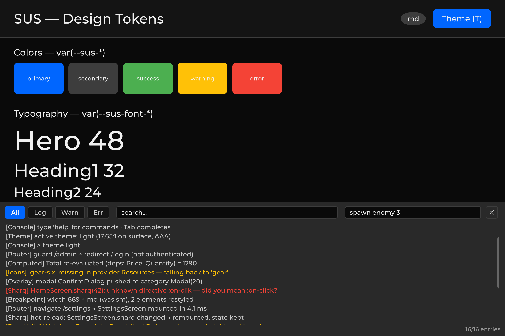

# 17 – Dev Console: SusConsoleService, SusConsoleDriver

> Service: `SusConsoleService` (sus-core/Runtime/Services/)
> Driver: `SusConsoleDriver` (sus-core/Runtime/Services/)

---

## 1. Purpose

An in-game dev console: intercepts Unity logs and displays them on top of the entire UI
(category `Console = 50` - the very top), lets you filter/search, and run
commands. The main use case is debugging on a device/build without the Editor Console.



---

## 2. Setup

Wrap in `#if` to exclude it from release builds:

```csharp
#if DEVELOPMENT_BUILD || UNITY_EDITOR
var overlay = SusBootstrap.GetOrCreateOverlay(uiDocument.rootVisualElement);
var console = new SusConsoleService
{
    OverlayHost = overlay,
    ToggleKey = KeyCode.BackQuote, // ~
    MaxEntries = 500,
};
console.Attach(); // subscribes to the log, spawns the hotkey driver, sets Instance
#endif
```

`Attach()` does four things:
1. Subscribes to `Application.logMessageReceivedThreaded`.
2. Creates (or finds) a `SusConsoleDriver` to poll `ToggleKey` in `Update`.
3. Registers the built-in commands (`clear`, `help`, `filter`).
4. Publishes the instance as `SusConsoleService.Instance` (the setter is private - don't assign it directly).

`Detach()` unsubscribes from the log and hides the UI.

---

## 3. Usage

### User interface

Pressing `~` opens the console from the bottom (40% of the screen height), a dark panel:

| Element | Description |
|---|---|
| Buttons **All / Log / Warn / Err** | Filter by type |
| Search field | Filter by substring (case-insensitive) |
| Command input field | Type a command → Enter → execute |
| **Tab** in the command field | Command name completion |
| ✕ | Close the console |

Colored logs: gray (Log), yellow (Warning), red (Error/Exception/Assert).
Auto-scrolls down for new messages; scrolling up manually stops the auto-scroll.

### Styling

The console has no inline C# styles: the whole overlay is described by
`Runtime/Resources/SusRuntime/sus-console.uss`, which the service loads onto its own root
on the first `Show()`. Colors come from design tokens (`--sus-bg-overlay`, `--sus-primary`,
`--sus-warning`, `--sus-error`, …), so the console follows the active theme.

To restyle it, override the classes in any sheet loaded after the console's own
(a project sheet on the panel, or `SusBootstrap.RegisterCascadeStyleSheet`):

| Class | Element |
|---|---|
| `.sus-console` | Overlay panel (position, height, background) |
| `.sus-console__toolbar` | Top row |
| `.sus-console__filter` / `--active` | Filter chips All / Log / Warn / Err |
| `.sus-console__field` + `__search` / `__command` | Text inputs |
| `.sus-console__close` | ✕ button |
| `.sus-console__list` | ScrollView with log lines |
| `.sus-console__line` + `--warning` / `--error` | Log line |
| `.sus-console__status` | Bottom status line (filter + entry count) |

Every `var()` in the sheet carries a fallback, so the console still looks right on a bare
panel that never went through `SusBootstrap` and has no token cascade.

### Registering commands

```csharp
#if DEVELOPMENT_BUILD || UNITY_EDITOR
SusConsoleService.Instance.RegisterCommand("spawn", args =>
{
    if (args.Length > 0)
        SpawnUnit(args[0]);
    else
        Debug.Log("Usage: spawn <unitId>");
}, help: "Spawn a unit by id");

SusConsoleService.Instance.RegisterCommand("gold", args =>
{
    int amount = args.Length > 0 ? int.Parse(args[0]) : 1000;
    player.Gold += amount;
    Debug.Log($"Added {amount} gold. Total: {player.Gold}");
}, help: "Add gold (default 1000)");
#endif
```

Built-in commands (registered automatically in `Attach`):

| Command | Description |
|---|---|
| `clear` | Clear the log buffer |
| `help` | List all commands |
| `filter <all\|log\|warn\|error>` | Toggle the filter |

---

## 4. Architecture

### Thread safety

`Application.logMessageReceivedThreaded` can be called from a background thread.
Entries are appended to a `Queue<SusLogEntry>` under a `lock`, and `SusConsoleDriver.Update()`
calls `DrainPendingEntries()` on the main thread - it moves records into the ring
buffer and updates the UI.

### Ring buffer

When it overflows (`MaxEntries`, default 500), old entries are evicted:

```csharp
if (_buffer.Count >= MaxEntries)
    _buffer.RemoveAt(0);
_buffer.Add(entry);
```

### Lazy UI construction

The UI (`_root`, `_scrollView`, toolbar, command field) is built on the first `Show()`.
While closed, the console creates no `VisualElement`s - zero rendering overhead.

### Z-order

`OverlayCategory.Console = 50` — the top layer of the **screen-space** OverlayHost.
The console is always above modals, tooltips, dropdowns, and toasts.

World-space UI (health bars) is **not** part of this stack: it uses a separate panel
**under** the screens. See [07-overlayhost.md](./07-overlayhost.md).

```
World-space panel                         ← UNDER screens (not OverlayHost)
└── healthbar / nameplate / …

Screen UIDocument
├── SusRouteView                          ← screens
└── OverlayHost
     ├── [Transition = 10]
     ├── [Modal      = 20]
     ├── [Tooltip    = 30]  ← above modals
     ├── [Dropdown   = 40]
     ├── [Toast      = 45]
     └── [Console    = 50]  ← console here (topmost)
```

---

## 5. API

### SusConsoleService

| Method/Property | Type | Description |
|---|---|---|
| `Attach()` | void | Log subscription + hotkey driver |
| `Detach()` | void | Unsubscribe + close |
| `Show()` | void | Show the console |
| `Hide()` | void | Hide it |
| `Toggle()` | void | Toggle it |
| `Clear()` | void | Clear the buffer |
| `DrainPendingEntries()` | void | Move records from the queue to the buffer (main thread) |
| `SetFilter(filter)` | void | `ConsoleFilter.All/Log/Warning/Error` |
| `SetSearch(text)` | void | Filter by substring |
| `RegisterCommand(name, handler, help)` | void | Register a command |
| `ExecuteCommand(input)` | bool | Execute a command line |
| `IsOpen` | bool | Whether the console is open |
| `OverlayHost` | OverlayHost | Portal container |
| `ToggleKey` | KeyCode | Hotkey (default `~`) |
| `MaxEntries` | int | Ring buffer size (500) |
| `Instance` | static SusConsoleService | Singleton |

### SusConsoleDriver

```csharp
public class SusConsoleDriver : MonoBehaviour
{
    public SusConsoleService Service;

    private void Update()
    {
        if (Input.GetKeyDown(Service.ToggleKey))
            Service.Toggle();
        Service.DrainPendingEntries();
    }
}
```

### SusLogEntry

```csharp
public struct SusLogEntry
{
    public LogType Type;        // Log, Warning, Error, Exception, Assert
    public string Message;      // Text
    public string StackTrace;   // Stack (for errors)
    public float Time;          // Time.unscaledTime
}
```

### ConsoleFilter

```csharp
public enum ConsoleFilter { All, Log, Warning, Error }
```

---

## 6. Tests

| File | Tests | What it covers |
|---|---|---|
| `sus-core/Runtime/Tests/SusConsoleServiceTests.cs` | 10 playmode | Show/Hide/Toggle, log interception, buffer overflow, filter, search, RegisterCommand/ExecuteCommand, Clear |
