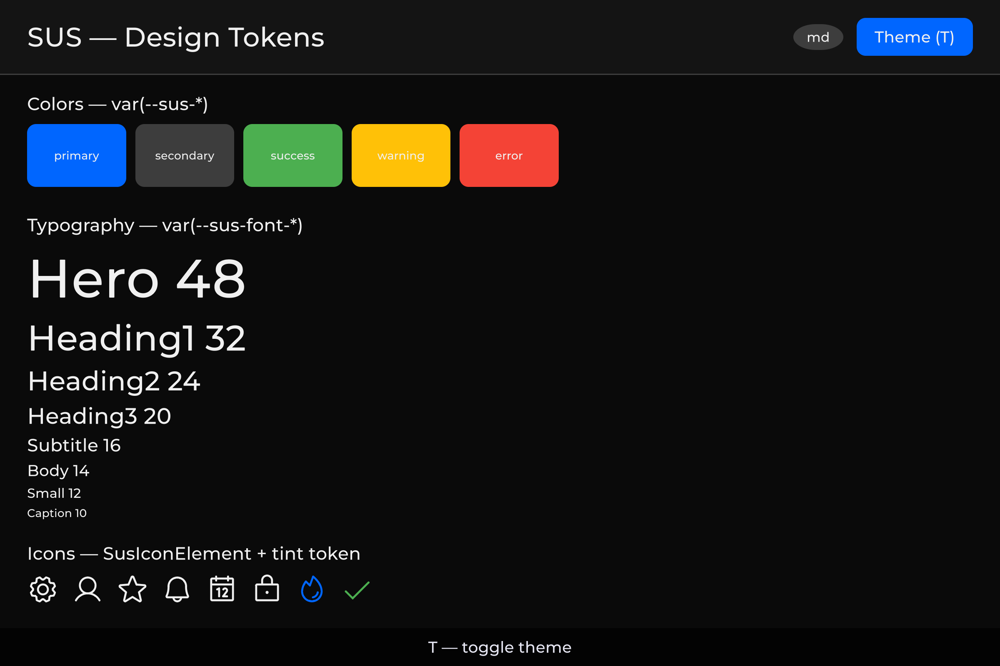
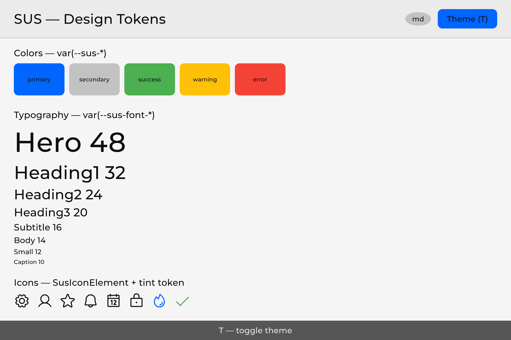
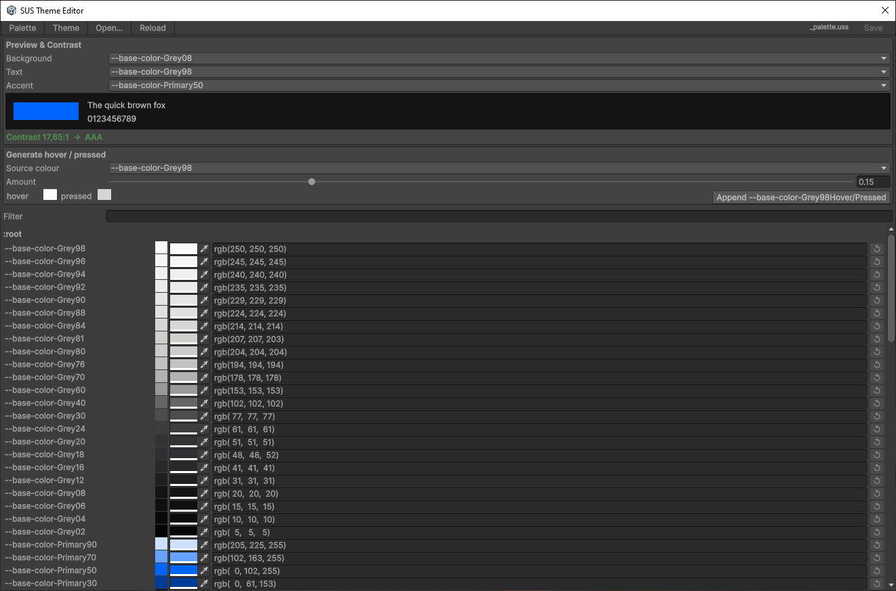

<!-- generated file — do not edit -->
# SUS — Design Tokens: fonts, colors, icons, themes

> Design token architecture for the new SUS.  
> Source of truth for themes, fonts and icons in SUS (StyleSheet cascade + Resources).
> **Principle:** everything is done through a CSS cascade and `var()` — the component does not know specific values, only semantic tokens.

<table>
<tr>
<td><br><sub>Colors, typography and icons — Dark</sub></td>
<td><br><sub>Same tokens — Light</sub></td>
</tr>
</table>

---

## Content

1. [General architecture](#1-general-architecture) (incl. [restyle without C#](#1-4-restyle-without-editing-c))
2. [Fonts](#2-fonts)
3. [Colors: three-layer token system](#3-colors-three-layer-token-system)
4. [Icons: Phosphor Icons](#4-icons-phosphor-icons)
5. [Themes: switching Light/Dark](#5-themes-switching-light-dark)
6. [Responsive breakpoints](#6-responsive-breakpoints) (incl. [sizing token families](#6-1-sizing-token-families-what-scales-what-doesn-t))
7. [Bootstrap: how everything is put together](#7-bootstrap-how-everything-is-put-together)
8. [File structure](#8-file-structure)
9. [Historical checklist](#9-historical-checklist)
10. [Appendix A: token summary table](#appendix-a-token-summary-table)
11. [Appendix B: key rules and patterns](#appendix-b-key-rules-and-patterns-identified-during-the-process)

---


## 1. General architecture


### 1.1 Principle

```
The component writes: And receives:
  color: var(--sus-text-primary) → rgba(255,255,255,1) (in dark theme)
  font-size: var(--sus-font-size-body) → 14px (semantic size from _font.uss)
  -unity-font: var(--sus-font-body) → Montserrat (family bridge)
```

Tokens are resolved through a CSS cascade. Variables are defined in `:root` USS files that connect via direct `root.styleSheets.Add()`.

### 1.2 Three layers of tokens

```
LAYER 1 — Raw values (ground truth)
  _palette.uss                     — --base-color-*, --base-space-*, --base-font-*, --base-radius-*
  _font.uss                        — --font-family-*, --font-heading, --font-body

LAYER 2 — Theme aliases (light/dark switch)
  _theme.uss (:root + .theme-dark)  — --thm-* (dark default)
  _theme.uss (.theme-light)         — --thm-* (light override)

LAYER 3 — Semantic UI tokens
  design-tokens.uss                 — --sus-* (delegates to --thm-*)
  _icon.uss                         — .sus-icon-bg utility class
```

**Load order** (container cascade via `SusBootstrap.LoadTokenCascade` / `SusApp`):
`_palette` → `_font` → `_theme` → `design-tokens` → `_icon` → registered extras (L4/L5) → OverlayHost.

Panel-level TSS (`SusDefault.tss` / `ApplyDefaultTSS`) also includes `_palette`, `_font`, and
optional `_global` — `_global` is **not** part of the container cascade.

Theme is switched by adding/removing `.theme-dark` / `.theme-light` on the cascade root
(`SusThemeService.Instance.SetTheme(root, theme)`).


### 1.3 How it works in the old scheme

`SusDataManager.LoadUIResolutionThemes()` (legacy) created multiple theme presets.
**In SUS this is simplified** — Dark/Light only via `.theme-*` classes; screen-size adaptation
is **breakpoints only** (`SusBreakpointService` + `.breakpoint-*` token overrides). See
[06-responsive.md](./06-responsive.md).

### 1.4 Restyle without editing C#

The token cascade is not only an internal hygiene rule — it is the supported way to make
controls look like *your* game **without editing C#**:

1. **Tokens (`--sus-*`)** — override semantic tokens (or the L1/L2 values they delegate to) on
   the cascade root. Every consumer of those tokens recolors together: one sheet change, whole UI.
2. **Classes** — add a project USS rule on a component or element class for a one-off look
   (button, panel, row) without forking the component script.
3. **States as classes** — hover / active / disabled / selected (and similar) are driven by USS
   classes or UITK pseudo-classes. C# only toggles membership
   (`AddToClassList` / `RemoveFromClassList` or the Sharq equivalent). Restyling a state is the
   same job as restyling the base: change the sheet, not the script.

**Policy vs debt.** Look-and-feel that buyers need to override belongs in USS — classes and
tokens, never inline. Runtime code switches appearance by calling `AddToClassList` /
`RemoveFromClassList` / `EnableInClassList`; it does not assign `.style.<X>` for anything a class
could express — colors, fonts, and every on/off switch (`display`, `position`, `flex*`, `align*`,
`justify*`, text alignment and similar). The only legitimate direct write is a continuous value
computed from data at runtime that no class enumeration could cover — a size measured from a
prop, a tween's current frame, a color parsed from a per-instance string, a floating tooltip's
position measured from its anchor. Those call sites carry an inline comment naming the reason
(`// sus:uss-impossible <why>`, plus `// sus:style-ok <why>` next to a color/font write) so the
exception is visible in the diff and can be audited — it is not a general-purpose styling API,
and writing `.style.<X>` to skip a USS class is a defect, not a shortcut. Hiding an element
follows the same rule: toggle a `sus-hidden` class (guarded in the component's own sheet, so the
element's own base rule is never `display: none`), don't set `display` from code.

---


## 2. Fonts


### 2.1 Current state

**Already made:** Montserrat (6 styles) comes with `sus-core`:

```
sus-core/Runtime/Resources/SusRuntime/
├── _font.uss
└── Fonts/Montserrat/
    ├── Montserrat-Regular.ttf    (400)
    ├── Montserrat-Medium.ttf     (500)
    ├── Montserrat-Bold.ttf       (700)
    ├── Montserrat-Black.ttf      (900)
    ├── Montserrat-Italic.ttf
    └── Montserrat-Light.ttf      (300)
```

`_font.uss` defines `:root { -unity-font: url("Fonts/Montserrat/Montserrat-Regular.ttf"); }` and CSS variables `--font-family-regular`, `--font-family-medium`, `--font-family-bold`, `--font-family-black`, `--font-family-italic`, `--font-family-light`.

`SusBootstrap.Mount<T>()` automatically loads `Resources/SusRuntime/_font.uss` with every mount.

### 2.2 Semantic fonts (shipped)

`_font.uss` defines:

- **Family slots** `--font-family-*` (Montserrat defaults). Optional project overrides use the fallback pattern documented in the `_font.uss` header (`var(…, url(...))`) — those override slots are **not** part of the published 61-token L3 inventory.
- **Semantic sizes (L3)** — components use these (not raw `--base-font-N`, and not numeric px aliases under the `--sus-` prefix):

```css
--sus-font-size-caption   /* ← --base-font-size-xs (10px) */
--sus-font-size-small     /* 12px */
--sus-font-size-body      /* 14px */
--sus-font-size-subtitle  /* 16px */
--sus-font-size-heading3  /* 20px */
--sus-font-size-heading2  /* 24px */
--sus-font-size-heading1  /* 32px */
--sus-font-size-hero      /* 48px */
```

`design-tokens.uss` also exposes **family bridges** for `-unity-font`:

`--sus-font-body` · `--sus-font-label` · `--sus-font-heading` · `--sus-font-italic`

#### 2.2.1 Raw L1 font sizes (palette)

`_palette.uss` still has raw `--base-font-10` … `--base-font-32`. Treat them as **palette internals**. Components and buyer samples must use the eight `--sus-font-size-caption` … `--sus-font-size-hero` tokens above.

#### 2.2.2 User override

Create `Assets/Resources/SusRuntime/_font.uss` — `Resources.Load` prefers the project copy. No code required. Open font-face gaps (Thin / ExtraLight / …) are tracked on the internal roadmap and are not part of this package.

---


## 3. Colors: three-layer token system


### 3.1 Layer 1 — Raw values (in `_palette.uss`)

The file that comes with `sus-core` in `Resources/`. Basic colors without semantics:

```css
/* sus-core/Runtime/Resources/SusRuntime/_palette.uss — Layer 1 */
:root {
    /* Greys */
    --base-color-Grey98:    rgb(250, 250, 250);
    --base-color-Grey94:    rgb(240, 240, 240);
    --base-color-Grey90:    rgb(229, 229, 229);
    --base-color-Grey80:    rgb(204, 204, 204);
    --base-color-Grey60:    rgb(153, 153, 153);
    --base-color-Grey40:    rgb(102, 102, 102);
    --base-color-Grey30:    rgb( 77,  77,  77);
    --base-color-Grey24:    rgb( 61,  61,  61);
    --base-color-Grey16:    rgb( 41,  41,  41);
    --base-color-Grey12:    rgb( 31,  31,  31);
    --base-color-Grey08:    rgb( 20,  20,  20);
    --base-color-Grey04:    rgb( 10,  10,  10);
    --base-color-Grey02:    rgb(  5,   5,   5);

    /* Primary (Blue) */
    --base-color-Primary90: rgb(205, 225, 255);
    --base-color-Primary70: rgb(102, 163, 255);
    --base-color-Primary50: rgb(  0, 102, 255);
    --base-color-Primary30: rgb(  0,  61, 153);
    --base-color-Primary10: rgb(  0,  20,  51);

    /* Accent / Success / Warning / Error */
    --base-color-Success:   rgb( 76, 175,  80);
    --base-color-Warning:   rgb(255, 193,   7);
    --base-color-Error:     rgb(244,  67,  54);
}
```


### 3.2 Layer 2 — Theme aliases (Dark/Light in `_theme.uss`)

L2 defines `--thm-*` only (no invented `--thm-bg` / `--thm-fail` / `--thm-text-inverse`). Full list lives in the USS file; key groups below match as-is.

**Dark theme (default):**

```css
/* sus-core/Runtime/Resources/SusRuntime/_theme.uss — Layer 2 Dark (excerpt) */
:root,
.theme-dark {
    /* Surface */
    --thm-bg-page:            var(--base-color-Grey04);
    --thm-bg-surface:         var(--base-color-Grey08);
    --thm-bg-surface-raised:  var(--base-color-Grey12);
    --thm-bg-surface-overlay: var(--base-color-Grey16);
    --thm-bg-surface-variant: var(--base-color-Grey18);
    --thm-bg-disabled:        var(--base-color-Grey40);

    /* Text */
    --thm-text-primary:       var(--base-color-Grey94);
    --thm-text-secondary:     var(--base-color-Grey80);
    --thm-text-disabled:      var(--base-color-Grey60);
    --thm-text-on-primary:    var(--base-color-Grey98);

    /* Border */
    --thm-border:             var(--base-color-Grey24);
    --thm-border-hover:       var(--base-color-Grey40);
    --thm-border-focus:       var(--base-color-Primary50);

    /* Brand / status */
    --thm-primary:            var(--base-color-Primary50);
    --thm-primary-hover:      var(--base-color-Primary70);
    --thm-primary-pressed:    var(--base-color-Primary30);
    --thm-secondary:          var(--base-color-Grey24);
    --thm-secondary-hover:    var(--base-color-Grey30);
    --thm-success:            var(--base-color-Success);
    --thm-success-hover:      var(--base-color-SuccessHover);
    --thm-warning:            var(--base-color-Warning);
    --thm-warning-hover:      var(--base-color-WarningHover);
    --thm-error:              var(--base-color-Error);
    --thm-error-hover:        var(--base-color-ErrorHover);
    --thm-info:               var(--base-color-Info50);
    --thm-info-hover:         var(--base-color-Info70);

    /* Scrim / overlays */
    --thm-scrim:              var(--base-color-BlackT30);
    --thm-hover-overlay:      var(--base-color-WhiteT5);
    --thm-selected-overlay:   var(--base-color-WhiteT10);
    --thm-disabled-overlay:   var(--base-color-WhiteT5);
}
```

**Light theme** (`.theme-light` — invertibles flip grey steps; brand/status mostly same `--base-*`):

```css
/* sus-core/Runtime/Resources/SusRuntime/_theme.uss — Layer 2 Light (excerpt) */
.theme-light {
    --thm-bg-page:            var(--base-color-Grey96);
    --thm-bg-surface:         var(--base-color-Grey92);
    --thm-bg-surface-raised:  var(--base-color-Grey88);
    --thm-bg-surface-overlay: var(--base-color-Grey84);
    --thm-bg-surface-variant: var(--base-color-Grey81);
    --thm-bg-disabled:        var(--base-color-Grey60);

    --thm-text-primary:       var(--base-color-Grey06);
    --thm-text-secondary:     var(--base-color-Grey20);
    --thm-text-disabled:      var(--base-color-Grey40);
    --thm-text-on-primary:    var(--base-color-Grey98);

    --thm-border:             var(--base-color-Grey76);
    --thm-border-hover:       var(--base-color-Grey60);
    --thm-border-focus:       var(--base-color-Primary50);

    --thm-secondary:          var(--base-color-Grey76);
    --thm-secondary-hover:    var(--base-color-Grey70);
    --thm-hover-overlay:      var(--base-color-BlackT10);
    --thm-selected-overlay:   var(--base-color-BlackT18);
    --thm-disabled-overlay:   var(--base-color-BlackT10);
    --thm-scrim:              var(--base-color-BlackT30);
    /* primary / success / warning / error / info — same --base-* as dark */
}
```

See `_theme.uss` for the complete block (including game-utility `--thm-rare` / `--thm-heal` / … — L2 only, not mirrored as `--sus-*`).


### 3.3 Layer 3 — Semantic UI tokens (`design-tokens.uss` + font sizes)

Public L3 API: **61** `--sus-*` definitions — **53** in `design-tokens.uss` plus **8** semantic font-size tokens in `_font.uss`. Copy from these files; do not invent component-level color aliases (buttons, inputs, tooltips, scrollbars) — compose L3 instead.

```css
/* sus-core/Runtime/Resources/SusRuntime/design-tokens.uss — Layer 3 (as-is) */
:root {
    /* ── Surface ── */
    --sus-bg-page:            var(--thm-bg-page);
    --sus-bg-surface:         var(--thm-bg-surface);
    --sus-bg-surface-raised:  var(--thm-bg-surface-raised);
    --sus-bg-overlay:         var(--thm-bg-surface-overlay);

    /* ── Text ── */
    --sus-text-primary:       var(--thm-text-primary);
    --sus-text-secondary:     var(--thm-text-secondary);
    --sus-text-disabled:      var(--thm-text-disabled);
    --sus-text-on-primary:    var(--thm-text-on-primary);

    /* ── Border ── */
    --sus-border:             var(--thm-border);
    --sus-border-hover:       var(--thm-border-hover);
    --sus-border-focus:       var(--thm-border-focus);
    --sus-divider:            var(--thm-border);

    /* ── Scrim ── */
    --sus-scrim:              var(--thm-scrim);

    /* ── Surfaces ── */
    --sus-bg-surface-variant: var(--thm-bg-surface-variant);
    --sus-bg-disabled:        var(--thm-bg-disabled);

    /* ── Primary ── */
    --sus-primary:            var(--thm-primary);
    --sus-primary-hover:      var(--thm-primary-hover);
    --sus-primary-pressed:    var(--thm-primary-pressed);

    /* ── Secondary ── */
    --sus-secondary:          var(--thm-secondary);
    --sus-secondary-hover:    var(--thm-secondary-hover);

    /* ── Semantic colors ── */
    --sus-success:            var(--thm-success);
    --sus-success-hover:      var(--thm-success-hover);
    --sus-warning:            var(--thm-warning);
    --sus-warning-hover:      var(--thm-warning-hover);
    --sus-error:              var(--thm-error);
    --sus-error-hover:        var(--thm-error-hover);
    --sus-info:               var(--thm-info);
    --sus-info-hover:         var(--thm-info-hover);

    /* ── Overlay accents (hover/selected/disabled states) ── */
    --sus-hover-overlay:      var(--thm-hover-overlay);
    --sus-selected-overlay:   var(--thm-selected-overlay);
    --sus-disabled-overlay:   var(--thm-disabled-overlay);

    /* ── Opacity states ── */
    --sus-opacity-hover:      0.04;
    --sus-opacity-focus:      0.12;
    --sus-opacity-selected:   0.08;
    --sus-opacity-disabled:   0.38;

    /* ── Font family bridges (-unity-font) ── */
    --sus-font-body:         var(--base-font-body);
    --sus-font-label:        var(--base-font-label);
    --sus-font-heading:      var(--base-font-heading);
    --sus-font-italic:       var(--base-font-italic);

    /* ── Spacing ── */
    --sus-space-0:  0px;
    --sus-space-4:  var(--base-space-4);
    --sus-space-8:  var(--base-space-8);
    --sus-space-12: var(--base-space-12);
    --sus-space-16: var(--base-space-16);
    --sus-space-24: var(--base-space-24);
    --sus-space-32: var(--base-space-32);
    --sus-space-48: var(--base-space-48);
    --sus-space-64: var(--base-space-64);

    /* ── Radius ── */
    --sus-radius-sm:   var(--base-radius-sm);
    --sus-radius-md:   var(--base-radius-md);
    --sus-radius-lg:   var(--base-radius-lg);
    --sus-radius-xl:   var(--base-radius-xl);
    --sus-radius-full: var(--base-radius-full);
}
```

**Font sizes** (also L3; defined in `_font.uss`, not in `design-tokens.uss`):

```css
/* sus-core/Runtime/Resources/SusRuntime/_font.uss — semantic sizes */
:root {
    --sus-font-size-caption:  var(--base-font-size-xs);
    --sus-font-size-small:    var(--base-font-size-sm);
    --sus-font-size-body:     var(--base-font-size-md);
    --sus-font-size-subtitle: var(--base-font-size-lg);
    --sus-font-size-heading3: var(--base-font-size-xl);
    --sus-font-size-heading2: var(--base-font-size-2xl);
    --sus-font-size-heading1: var(--base-font-size-3xl);
    --sus-font-size-hero:     var(--base-font-size-4xl);
}
```

**Composition (not L3 tokens):** buttons/inputs/tooltips/scrollbars compose the tokens above — e.g. primary button `background-color: var(--sus-primary)`; label `color: var(--sus-text-on-primary)`; hover `var(--sus-primary-hover)`; dim modal backdrop `var(--sus-scrim)`; elevated panel surface `var(--sus-bg-overlay)` or `var(--sus-bg-surface-raised)`.

**Layout usage of the space scale:** keep sibling gaps at `--sus-space-8` or larger, keep rows aligned, avoid clipped content, and use tokens only (no raw pixel values).


### 3.4 Use in components

```xml
<!-- Card.sharq — compose L3 tokens (no component-level color aliases) -->
<style scoped>
.card {
    background-color: var(--sus-bg-surface);
    border-width: 1px;
    border-color: var(--sus-border);
    border-radius: var(--sus-radius-md);
    color: var(--sus-text-primary);
    padding: var(--sus-space-16);
}
.card__title {
    font-size: var(--sus-font-size-heading3);
    -unity-font: var(--sus-font-heading);
    color: var(--sus-text-primary);
}
.card__body {
    font-size: var(--sus-font-size-body);
    color: var(--sus-text-secondary);
    margin-top: var(--sus-space-8);
}
.card__cta {
    background-color: var(--sus-primary);
    color: var(--sus-text-on-primary);
}
.card__cta:hover {
    background-color: var(--sus-primary-hover);
}
.card__link {
    color: var(--sus-primary); /* links: brand color, not a separate link token */
}
</style>
```

---


## 4. Icons: Phosphor Icons

SUS ships **[Phosphor Icons](https://phosphoricons.com/)** (MIT) as VectorImage SVGs — not Bootstrap Icons.
There is no `Icons/bootstrap/` tree anymore.

| Set | Path | Size | Role |
|-----|------|------|------|
| **Core** | `Resources/SusRuntime/Icons/core/{regular,fill}/` | ~127 SVGs | Built-in set, always present: everything the components and the downstream UI packages use by default |
| **Phosphor** | `Samples~/PhosphorIcons/Resources/SusRuntime/Icons/phosphor/{thin,light,regular,bold,fill,duotone}/` | **1512 names × 6 weights ≈ 9000 SVGs** | Optional full library, imported as the `Phosphor Icon Set` sample |

**Weights** (`SusIconWeight`): `Thin`, `Light`, `Regular` (default), `Bold`, `Fill`, `Duotone`.

**Status:** ✅ runtime + editor auto-register both providers; downstream UI packages use the same registry.

The full set lives outside the package on purpose: a `Resources` folder is included in every player
build and cannot be stripped, so 9000 SVGs would cost every consumer ~19 MB whether they use them or
not. `PhosphorIconProvider` reads from any `Assets/**/Resources/SusRuntime/Icons/phosphor/` folder, so
importing the sample — or copying just the few icons you need into your own `Resources` folder — both
work. Without it, `SusIconRegistry` resolves through the core subset and returns `null` for the long
tail instead of failing.

### 4.1 Layout on disk

```
sus-core/Runtime/Resources/SusRuntime/Icons/
└── core/
    ├── regular/     star.svg, gear.svg, …
    └── fill/        star-fill.svg, …          (weight folder + optional -fill suffix)

sus-core/Samples~/PhosphorIcons/Resources/SusRuntime/Icons/    (optional sample)
└── phosphor/
    ├── thin/
    ├── light/
    ├── regular/     {name}.svg
    ├── bold/        {name}-bold.svg
    ├── fill/        {name}-fill.svg
    └── duotone/     {name}-duotone.svg
```

Loader convention (`ResourcesFolderIconProvider`): resources path  
`SusRuntime/Icons/{collection}/{weightFolder}/{fileName}`  
where `fileName` is `{name}` for `regular`, else `{name}-{weight}`.

Two constructors:

- `new ResourcesFolderIconProvider("app")` — **project-local** overload (no package id). Serves
  icons from **any** `Assets/**/Resources/SusRuntime/Icons/app/…` folder (including the wizard's
  `Customization/Icons/Resources/…`). Use this for your app's own icons.
- `new ResourcesFolderIconProvider("com.my.game", "app")` — **packaged** overload. The first
  argument is the **UPM package id** whose `Runtime/Resources/SusRuntime/Icons/app/…` holds the
  icons (editor scan + `.meta` repair are resolved against that package). Use this only when you
  ship icons inside your own package. Do **not** pass `"com.sharq-it.sus.core"` for your project
  icons — that points the scan at the core package.

### 4.2 How icon lookup works

```
SusIcon / SusIconRegistry.Load(alias, weight)
  → resolve semantic aliases (e.g. "settings" → "gear")
  → optional name suffix "-fill" / "-bold" / … overrides weight
  → query ISusIconProvider list (first hit wins):
       1. Project providers (SusApp.UseIcons / RegisterProvider highest priority)
       2. CoreIconProvider          (Icons/core)
       3. PhosphorIconProvider      (any Assets/**/Resources/…/Icons/phosphor, auto via PhosphorIconBootstrap)
```

`PhosphorIconBootstrap` registers Phosphor at **SubsystemRegistration** / editor load with
`asHighestPriority: false`, so core + project icons keep precedence for overlapping names.

### 4.3 API (current)

```csharp
// Weight enum — not the old SusIconStyle Outline/Filled
public enum SusIconWeight { Thin, Light, Regular, Bold, Fill, Duotone }

// Core primitive (also used under the hood)
var icon = new SusIcon("gear");                      // Regular
var star = new SusIcon("star", SusIconWeight.Fill);
icon.Name.Value = "x";                               // reactive

VectorImage img = SusIconRegistry.Load("star", SusIconWeight.Fill);
SusIconRegistry.AddAlias("settings", "gear");
SusIconRegistry.RegisterProvider(myProvider, asHighestPriority: true);

// SusApp — project icons win over Phosphor
SusApp.Create(uiDocument)
    .UseIcons(new ResourcesFolderIconProvider("com.my.game", "app"))
    .Mount<HomeScreen>();
```

Downstream UI packages may expose a higher-level icon component:

```xml
<sus:SusIcon Icon="star" Weight="Fill" Size="md" />
```

`Kind=phosphor|game|portrait|auto` — game/portrait use the consumer media bridge; see your optional component package documentation.

### 4.4 SVG import settings (IMPORTANT)

Every `.svg.meta` should use UI Toolkit Vector Image + antialiased tessellation:

```yaml
svgType: 3                          # UI Toolkit Vector Image
tessellationMode: 1                 # Antialiased Arc Encoding (NOT 0)
textureSize: 256
sampleCount: 4
```

Without `tessellationMode: 1`, curves look pixelated.

### 4.5 Auxiliary USS

**`_icon.uss`** — global class for plain `VisualElement` / core `SusIcon` (`.sus-icon-bg`):

```css
.sus-icon-bg {
    background-size: contain;
    background-repeat: no-repeat;
    background-position: center;
    -unity-background-image-tint-color: rgb(255, 255, 255);
    flex-shrink: 0;
}
```

Loaded with the token cascade (`SusBootstrap` / `SusApp`).

### 4.6 USS vs C# for icons

| What | Where | Why |
|-----|-----|--------|
| `background-size/position/repeat`, `flex-shrink` | USS (`.sus-icon-bg` / companion) | Static |
| Default tint | USS | Theme can override |
| `backgroundImage` | C# via `SusIconRegistry.Load` | Runtime asset |
| Size / weight / name | Props / C# | Dynamic |

### 4.7 Custom / project icons

Do **not** drop files into a fictional `Icons/bootstrap/custom/`. Prefer:

1. **`ResourcesFolderIconProvider`** pointing at your collection under  
   `Resources/SusRuntime/Icons/{yourCollection}/{weight}/`, then  
   `SusApp.UseIcons(...)` or `SusIconRegistry.RegisterProvider(...)`.
2. Or **`SusIconSetAsset`** + `SusApp.UseIcons(iconSet)`.
3. Semantic aliases: `SusIconRegistry.AddAlias("my-settings", "gear")`.

Setup Project scaffolding uses `Customization/Icons/.../app/` + `ResourcesFolderIconProvider("app")` (the project-local overload) as the project override layer.

---


## 5. Themes: switching Light/Dark


### 5.1 How it works in the previous scheme

- `UIResolutionThemes` — ScriptableObject with an array of 6 `StyleTheme` (Dark/Light/CustomLight × High/Low)
- `panel.themeStyleSheet` = `ThemeStyleSheet` (`.tss`), which through `@import` pulls the USS chain
- `PollScreenWidth()` in `Update` — switches High/Low when crossing 1600px
- `SetStyleTheme()` — switches Dark/Light/CustomLight


### 5.2 SUS — current API

**No `ThemeStyleSheet` for theme switching** — USS sheets are added to the container via
`LoadTokenCascade` / `SusApp`. Theme variants are CSS classes on the cascade root.

**Layer files:**
- `_palette.uss` — L1 `--base-*` (raw values)
- `_theme.uss` — L2 `--thm-*` for `.theme-dark` / `.theme-light`

**Runtime API** (`SusTheme` is a `readonly struct`; service is a singleton):

```csharp
// sus-core/Runtime/SusTheme.cs + Runtime/Services/SusThemeService.cs
namespace Sharq.Core
{
    public readonly struct SusTheme
    {
        public string Name { get; }
        public SusTheme(string name);
        public static SusTheme Dark => new("dark");
        public static SusTheme Light => new("light");
        public string CssClass => $"theme-{Name}";  // "theme-dark", "theme-light", …
    }

    public class SusThemeService
    {
        public static SusThemeService Instance { get; }
        public static Prop<SusTheme> Current { get; }

        // Applies .theme-{name} on the cascade root + OverlayHost
        public void SetTheme(VisualElement root, SusTheme theme);
    }
}
```

Usage:

```csharp
SusThemeService.Instance.SetTheme(root, SusTheme.Dark);
SusThemeService.Instance.SetTheme(root, SusTheme.Light);
SusThemeService.Instance.SetTheme(root, new SusTheme("midnight"));  // custom → .theme-midnight

Watch(SusThemeService.Current, (_, next) => AdaptToTheme(next));
```

CSS switching through a class on the root — already in `_theme.uss` (see 3.2).


### 5.3 SusBootstrap / SusApp

`SusApp.Create(...).UseTheme(...).Mount/Run` applies the theme **last** so OverlayHost
receives the theme class. Prefer that path over manual `styleSheets.Add`.

`SusBootstrap.Mount<T>()` / `LoadTokenCascade` load the full cascade
(`_palette` → `_font` → `_theme` → `design-tokens` → `_icon` → extras + OverlayHost).

---


## 6. Responsive breakpoints

Screen-size adaptation is **only** `SusBreakpointService` (classes `.breakpoint-sm` …
`.breakpoint-2xl` on the cascade root). There is no High/Low resolution axis and no
automatic UI scale tied to monitor size.

Width is read from **`cascadeRoot.resolvedStyle.width`** on geometry changes (same
feed path as the removed `SusResolutionService`), with panel / Screen fallbacks
only when the root is not laid out yet. See [06-responsive.md](./06-responsive.md).

Package token sheets override package-specific tokens (heights, spacing, fonts) under those
classes. Components that already consume those vars pick up the active breakpoint without
per-component C#.

PanelSettings for samples/wizard use **ConstantPixelSize** so breakpoint width matches
the panel (no Unity `ScaleWithScreenSize` auto-scale).

### 6.1 Sizing token families: what scales, what doesn't

Every sizing property on a component — width, height, margin, padding, font size, border
radius, border width, letter spacing, position offsets, 9-slice borders — is expressed as a
token, never a bare number. That part of the rule is unconditional. The part that isn't
unconditional is whether the token's *value* changes when the breakpoint changes — some
families of sizes are meant to move with the screen, others are meant to stay put.

| Family | Examples | Moves with breakpoint? | Why |
|---|---|---|---|
| Spacing | `--sus-space-*` / `--sk-space-*` | yes | Layout density is exactly what a breakpoint answers |
| Control height | `--sk-form-height`, `--sk-row-height`, `--sk-button-height`, `--sk-input-height`, `--sk-table-row-height` and the size-tier consolidation that names them `--sk-control-h-*` | yes | Touch targets need to grow on a small screen even as spacing tightens |
| Font size | `--sk-font-*` | yes | Legibility at arm's length differs from legibility at a desk |
| Icon size, tooltip/menu max-width, the minimum touch target | `--sk-icon-*`, `--sk-tooltip-max-width`, `--sus-touch-min` | yes | Same reasoning as control height |
| Pill radius | `--sk-radius-pill`, `--sk-chip-radius*` | yes, but derived | A pill's radius is always half its own control's height, so it rides the height family instead of having a ladder of its own |
| Border width | hairline and thick borders, the focus-ring width | **no** | A hairline is a display-density concern — how many physical pixels make a crisp line — not a layout concern. Scaling it with logical width makes it vanish on some screens and double on others |
| Corner radius (everything except pill) | `--sk-radius-xs` … `--sk-radius-xl` | **no** | A control's silhouette should read the same on a phone and on a large monitor. Height and radius don't scale by the same factor — compact screens get *taller* controls and *tighter* spacing at once — so scaling radius with height would distort the shape instead of preserving it |
| Letter spacing | `--sk-tracking-*` | **no** | Tracking is a property of the typeface, not of the viewport |
| 9-slice borders | slice tokens | **no** | A slice border indexes a fixed source texture; moving the cut re-slices the image instead of resizing it |
| Sub-pixel optical nudges (a `top`/`right`/`bottom`/`left` of a few px used to correct alignment) | — | **no** | Same job as a hairline border — it compensates for rasterization, it isn't a layout offset |

The second half of the table isn't an oversight. Those five families are declared invariant on
purpose: the token still exists (so a project can still retheme it), but its value is the same
on every breakpoint, and that's a decision a project can rely on rather than a gap waiting to be
filled in.

> **Status:** this table is the sizing contract the kit is converging on. Names already shipping
> today — `--sus-space-*`, `--sk-space-*`, `--sk-font-*`, `--sk-form-height` and its siblings,
> `--sk-radius-*`, `--sk-tracking-wide`/`--sk-tracking-medium` — keep working unchanged; the
> newer consolidated names (`--sk-control-h-*`, the hairline/thick border tokens, the full
> `--sk-tracking-*` set) and the single generated breakpoint sheet described below are landing as
> part of the same release. Check the kit changelog for the exact version before relying on a
> name that isn't in your installed copy yet.

### 6.2 How the ladder is composed, and how a project overrides it

Two axes decide which rung of a family's ladder is active:

- the **breakpoint** (`sm` … `2xl`, from screen width), and
- the **density** (`compact` / default / `comfortable`, an explicit product choice, not
  screen-size adaptation — see [06-responsive.md](./06-responsive.md)).

Both answer the same question — "how much room is there" — so they add up to a single step on
the ladder, and a project sees one coherent scale rather than two axes that fight each other.
A component's own size tier (`xs` … `xl`) answers a different question — "which of this
component's sizes is this particular instance" — so it picks a rung *within* the ladder instead
of shifting the ladder itself. Overriding the ladder therefore reflows every component that
uses it at once; choosing a different size tier never changes what the ladder contains.

There's no scale factor to tune — Unity's stylesheets have no arithmetic (no `calc()`, no
multiplier custom property), so the value at each combination of breakpoint and density is an
explicit, enumerated step rather than a computed one. A project that wants its own ladder
overrides the token values at the combinations it cares about, the same way it overrides any
other token (see [§1.4 Restyle without editing C#](#1-4-restyle-without-editing-c)) — it does not
edit individual components, and it does not gain a coefficient to compute the next size from the
last one.

One migration note for anyone who has already overridden a breakpoint-scoped selector directly
(`.breakpoint-xl .my-panel { width: 400px }`): that pattern still parses, but a future kit
release resolves breakpoint and density together with higher specificity than a single-class
selector, so a project override of that shape can stop winning. Overriding the token itself
(rather than re-declaring the property under a breakpoint class) isn't affected by that change —
it's the pattern this section recommends. Watch the changelog for the exact release.

---


## 7. Bootstrap: how everything is put together


### 7.1 Boot order (prefer `SusApp`)

```
SusApp.Create(uiDocument)
  ├─ ApplyDefaultTSS (panel: _palette + _font + _global via SusDefault.tss)
  ├─ EnsureEventSystem
  ├─ UseIcons → SusIconRegistry
  ├─ LoadTokenCascade (container):
  │     _palette → _font → _theme → design-tokens → _icon → extras
  │     + Breakpoint/Density/Scale services + OverlayHost
  ├─ EnsureWorldSpacePanel (if UseWorldSpace && playing)
  ├─ UseFonts / UseCustomStyles
  ├─ Configure callbacks (router / manual UI)
  ├─ Mount<T> (optional)
  └─ SusThemeService.Instance.SetTheme(root, theme)   ← last
```

**Important:** the container cascade always includes `_palette` and `_theme` (not only
`design-tokens`). Prefer `SusApp` over hand-rolled `root.styleSheets.Add(...)`.

> **World-space panel caveat.** `EnsureWorldSpacePanel` gives the world panel its own token
> cascade (`_palette → _font → _theme → design-tokens`), which already includes `_font.uss` — so
> a typeface exported via `Window > SUS > Fonts > Export Font Set to USS` (or set by hand in
> `--sus-font-family-*`) reaches the world panel the same way it reaches everything else, no
> extra step needed. `UseCustomStyles` (branding) and `SetTheme`, however, **are applied only to
> the screen root + OverlayHost** — not to the world panel. So world UI (healthbars/nameplates
> from a downstream UI package) renders with the **default** Dark theme and no branding override
> unless you apply them to `app.WorldPanel` / `WorldSpaceService.Default.WorldSpacePanel`
> yourself (e.g. `SusThemeService.Instance.SetTheme(worldRoot, theme)` and load your branding USS
> onto it).


### 7.2 What each layer defines

```
_palette.uss     — L1: --base-color-*, --base-space-*, --base-font-*, --base-radius-*
_font.uss        — font families (--font-family-*) + optional family override slots + --sus-font-size-caption…hero
_theme.uss       — L2: --thm-* for .theme-dark / .theme-light
design-tokens.uss— L3: --sus-* semantic tokens (colors, space, radius, font family bridges)
_icon.uss        — .sus-icon-bg utility
```

### 7.3 Minimal example

```csharp
public class AppEntry : MonoBehaviour
{
    public UIDocument uiDocument;

    void Start()
    {
        SusApp.Create(uiDocument)
            .UseTheme(SusTheme.Dark)
            .Mount<App>();
        // Fonts, colors, icons, OverlayHost, theme — all wired.
    }
}
```

Lower-level alternative (manual cascade):

```csharp
void Start()
{
    SusBootstrap.ApplyDefaultTSS(uiDocument);
    var root = uiDocument.rootVisualElement;
    SusBootstrap.LoadTokenCascade(root);
    SusBootstrap.Mount<App>(root);
    SusThemeService.Instance.SetTheme(root, SusTheme.Dark);
}
```

---


## 8. File structure


### 8.1 In `sus-core` (comes with package)

```
sus-core/
├── Docs/
│   └── DESIGN_TOKENS.md          ← this document
│
├── Runtime/
│   ├── Resources/SusRuntime/
│   │   ├── _palette.uss          ← L1 --base-*                  ✅
│   │   ├── _font.uss             ← Fonts (Montserrat)           ✅
│   │   ├── _theme.uss            ← L2 --thm-*                   ✅
│   │   ├── design-tokens.uss     ← L3 --sus-*                   ✅
│   │   ├── _icon.uss             ← .sus-icon-bg                 ✅
│   │   ├── Fonts/Montserrat/     ← 6 .ttf
│   │   └── Icons/
│   │       └── core/{regular,fill}/
│   │           (full phosphor/{thin,light,regular,bold,fill,duotone}/
│   │            ships as the optional Samples~/PhosphorIcons sample)
│   ├── SusTheme.cs / Services/SusThemeService.cs
│   ├── SusBreakpointService.cs
│   ├── SusIconRegistry.cs + icon providers
│   ├── SusIcon.cs
│   ├── SusApp.cs
│   └── SusBootstrap.cs
```

**Versioning note:** the package version is tracked in `package.json`.
For every `.cs` change in `sus-core`, bump `package.json` (pre-push hook requires it).


### 8.2 In a user project (optional override)

```
Assets/Resources/SusRuntime/
├── _font.uss      ← font override
├── _palette.uss   ← L1 palette override (optional)
├── _theme.uss     ← L2 theme override (optional)
└── Icons/
    └── {yourCollection}/{regular|fill|…}/  ← via ResourcesFolderIconProvider
```

Or use `SusApp.UseIcons(...)` / `SusIconSetAsset` — see §4.7.

### 8.3 SUS Theme Editor (Editor tool)

An Editor window for editing `_palette.uss` visually instead of hand-typing `rgb()` values:
color swatches per token (`--base-color-*`), a preview strip with a live contrast ratio,
and a generator for hover/pressed variants from a source color. Saves back to the project's
`_palette.uss` override.



---


## 9. Historical checklist

Phases B–F (palette/theme/L3 tokens, breakpoints, Phosphor icons, SusApp cascade, docs) are **done**. This buyer page is not a roadmap.

Open font-face work (Thin / ExtraLight / SemiBold / ExtraBold and related `_font.uss` expansions) is tracked on the internal roadmap and is not part of this package.

| Phase | Outcome | Status |
| --- | --- | --- |
| A — Fonts (shipped subset) | Montserrat 6 styles + semantic font-size tokens + family bridges | ✅ (open faces → internal plan) |
| B — Colors | `_palette` / `_theme` / `design-tokens` + `SusThemeService` | ✅ |
| C — Dimensions / breakpoints | spacing/radius L1; `SusBreakpointService` | ✅ |
| D — Icons | Core subset + optional Phosphor sample + registry | ✅ |
| E — Bootstrap | `SusApp` / `LoadTokenCascade` | ✅ |
| F — Documentation | this page + package projection | ✅ |


## Appendix A: Token Summary Table

Public L3 inventory (**61** `--sus-*`). Source: `design-tokens.uss` + `_font.uss` (font-size tokens).

### Surfaces / text / border / scrim

| Token | Role | Layer |
| --- | --- | --- |
| `--sus-bg-page` | Page background | Color L3 |
| `--sus-bg-surface` | Card / panel | Color L3 |
| `--sus-bg-surface-raised` | Elevated surface | Color L3 |
| `--sus-bg-overlay` | Overlay surface (`--thm-bg-surface-overlay`) | Color L3 |
| `--sus-bg-surface-variant` | Variant surface | Color L3 |
| `--sus-bg-disabled` | Disabled fill | Color L3 |
| `--sus-text-primary` | Body text | Color L3 |
| `--sus-text-secondary` | Secondary text | Color L3 |
| `--sus-text-disabled` | Disabled text | Color L3 |
| `--sus-text-on-primary` | Text on filled primary | Color L3 |
| `--sus-border` | Default border | Color L3 |
| `--sus-border-hover` | Hover border | Color L3 |
| `--sus-border-focus` | Focus ring | Color L3 |
| `--sus-divider` | Divider | Color L3 |
| `--sus-scrim` | Modal / overlay dim | Color L3 |

### Brand / status / overlays / opacity

| Token | Role | Layer |
| --- | --- | --- |
| `--sus-primary`, `--sus-primary-hover`, `--sus-primary-pressed` | Brand | Color L3 |
| `--sus-secondary`, `--sus-secondary-hover` | Neutral accent | Color L3 |
| `--sus-success`, `--sus-success-hover` | Success | Color L3 |
| `--sus-warning`, `--sus-warning-hover` | Warning | Color L3 |
| `--sus-error`, `--sus-error-hover` | Error | Color L3 |
| `--sus-info`, `--sus-info-hover` | Info | Color L3 |
| `--sus-hover-overlay` | Hover wash | Color L3 |
| `--sus-selected-overlay` | Selected wash | Color L3 |
| `--sus-disabled-overlay` | Disabled wash | Color L3 |
| `--sus-opacity-hover`, `--sus-opacity-focus`, `--sus-opacity-selected`, `--sus-opacity-disabled` | Numeric opacities | Color L3 |

### Fonts

| Token | Role | Layer |
| --- | --- | --- |
| `--sus-font-body`, `--sus-font-label`, `--sus-font-heading`, `--sus-font-italic` | Family bridges (`-unity-font`) | Font L3 |
| `--sus-font-size-caption` | 10px | Size L3 |
| `--sus-font-size-small` | 12px | Size L3 |
| `--sus-font-size-body` | 14px | Size L3 |
| `--sus-font-size-subtitle` | 16px | Size L3 |
| `--sus-font-size-heading3` | 20px | Size L3 |
| `--sus-font-size-heading2` | 24px | Size L3 |
| `--sus-font-size-heading1` | 32px | Size L3 |
| `--sus-font-size-hero` | 48px | Size L3 |

### Spacing / radius

| Token | Role | Layer |
| --- | --- | --- |
| `--sus-space-0` … `--sus-space-64` (0,4,8,12,16,24,32,48,64) | Spacing scale | Size L3 |
| `--sus-radius-sm` … `--sus-radius-full` (sm,md,lg,xl,full) | Corner radius | Size L3 |

L1 helpers often used next to L3 (not counted in the 61): `--font-family-regular`, `--main-font-family`, `--base-space-*`, `--base-radius-*`.

---

## Appendix B: Key rules and patterns (identified during the process)

### B.1 Statics in USS, dynamics in C#

```
┌─────────────┬────────────────────────┬──────────────────────────┐
│ Where │ Examples │ Rule │
├─────────────┼────────────────────────┼──────────────────────────┤
│ USS (static)│ background-size, │ Do not change in runtime │
│ │ flex-shrink, │ from props - write in USS │
│             │ margin-left, color,    │                          │
│             │ font-size (layout)     │                          │
├─────────────┼────────────────────────┼──────────────────────────┤
│ C# (dynamics) │ width/height from Size, │ Change from props or │
│ │ tint from TintColor, │ runtime logic - in code │
│             │ backgroundImage        │                          │
│             │ (Resources.Load)       │                          │
└─────────────┴────────────────────────┴──────────────────────────┘
```

**Motivation:** The main source of change is props. By changing the props, we only change the dynamic attribute in C#. The statics are in USS and are not spread out in the code. This makes it easier to read and debug.

**Example (good):**

```csharp
// C# - only dynamic from props
el.style.width = size;   // sus:uss-impossible continuous value from prop Size
el.style.height = size;  // sus:uss-impossible continuous value from prop Size
el.AddToClassList("icon-row");             // ← statics in USS

/* USS:
.icon-row { flex-direction: row; align-items: center; margin-bottom: 6px; } */
```

The `sus:uss-impossible <reason>` comment is not decorative — it is what marks a `.style.<X>`
write as an intentional, audited exception instead of debt. Without it (or on a switch like
`flexDirection`/`alignItems` below) the same write is the antipattern in the next example.

**Example (bad - antipattern):**

```csharp
el.style.flexDirection = FlexDirection.Row;   // ← static in C# (migrate to USS)
el.style.alignItems = Align.Center;
el.style.color = new StyleColor(Color.white);
```

### B.2 Sharq bare `<style>` — how selectors work

```
Source (.sharq) Compiled (.uss) Does root match?
─────────────────────────────────────────────────────────────────────
<style> .sus-icon { ✅ YES
    flex-shrink: 0;            flex-shrink: 0;
</style>                   }

<style> .sus-icon .sus-icon { ❌ NO
.sus-icon { flex-shrink: 0;            (.sus-icon inside .sus-icon)
    flex-shrink: 0;        }
}
</style>

<style> .sus-icon .child { ✅ YES (if child is inside)
.child {                        ...                    }
    ...
}
</style>
```

**Rule:** if you need to style the ROOT of a component, write the properties directly in `<style>` without selector. If you need to style child elements, use their classes (without the component prefix).

In special cases (self-target, container-target - see rule `sharq-css-scoping.mdc`) — move the rule to companion `.uss` as unscoped.

### B.3 `backgroundImage` re-assert pattern

UI Toolkit Known Issue: `VectorImage` sometimes doesn't render on the first frame. Proven pattern (from old `SizedIcon`):

```csharp
el.style.backgroundImage = new StyleBackground(vec);  // sus:uss-impossible resolved icon asset from data
el.MarkDirtyRepaint();
el.schedule.Execute(() =>
{
    el.style.backgroundImage = new StyleBackground(vec);  // sus:uss-impossible resolved icon asset from data
    el.MarkDirtyRepaint();
}).ExecuteLater(0);
el.schedule.Execute(() =>
{
    el.style.backgroundImage = new StyleBackground(vec);  // sus:uss-impossible resolved icon asset from data
    el.MarkDirtyRepaint();
}).ExecuteLater(16);  // next frame
```

Reinstalling `backgroundImage` three times: immediately, after 0 frames, after ~1 frame. This ensures that `VectorImage` will not be “lost” when the tree is rebuilt.

### B.4 SVG Import: tessellationMode

| Parameter | Meaning | Why |
|-------------------|----------|--------|
| `svgType`         | `3`      | UI Toolkit Vector Image (not Texture2D) |
| `tessellationMode`| `1`      | Antialiased Arc Encoding - **smooth edges** on arcs |
| `textureSize`     | `256`    | Enough for icons up to 48px |
| `sampleCount`     | `4`      | Multisampling for subpixel AA |

**Never** use `tessellationMode: 0` (Basic Triangulation) - Gives pixelated/jagged edges on SVG curves.

### B.5 USS loading: prefer SusApp / LoadTokenCascade

```csharp
// ✅ Correct: SusApp (or LoadTokenCascade) on the document root
SusApp.Create(uiDocument)
    .UseTheme(SusTheme.Dark)
    .Mount<App>();
// Cascade order: _palette → _font → _theme → design-tokens → _icon → extras + OverlayHost
// Panel TSS (_global) via ApplyDefaultTSS / SusDefault.tss

// ✅ Lower-level
SusBootstrap.ApplyDefaultTSS(uiDocument);
SusBootstrap.LoadTokenCascade(uiDocument.rootVisualElement);

// ❌ Incorrect: hand-add only design-tokens without _palette/_theme
root.styleSheets.Add(designTokensSheet);
```

### B.6 Versioning sus-core

For any change to `.cs` in `sus-core`:
1. Increment the version in `sus-core/package.json` (patch version)
2. Commit with version tag
3. Push → cache in Unity Package Manager
4. Clear `Library/PackageCache/com.sharq-it.sus.core/` in the client
5. Delete `Packages/packages-lock.json`
6. Refresh Unity → the package will be resolved again

Script (`.uss`, `.svg`, `.meta`) changes do not require a manual cache flush.
