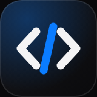
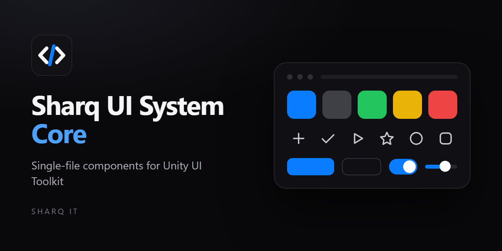
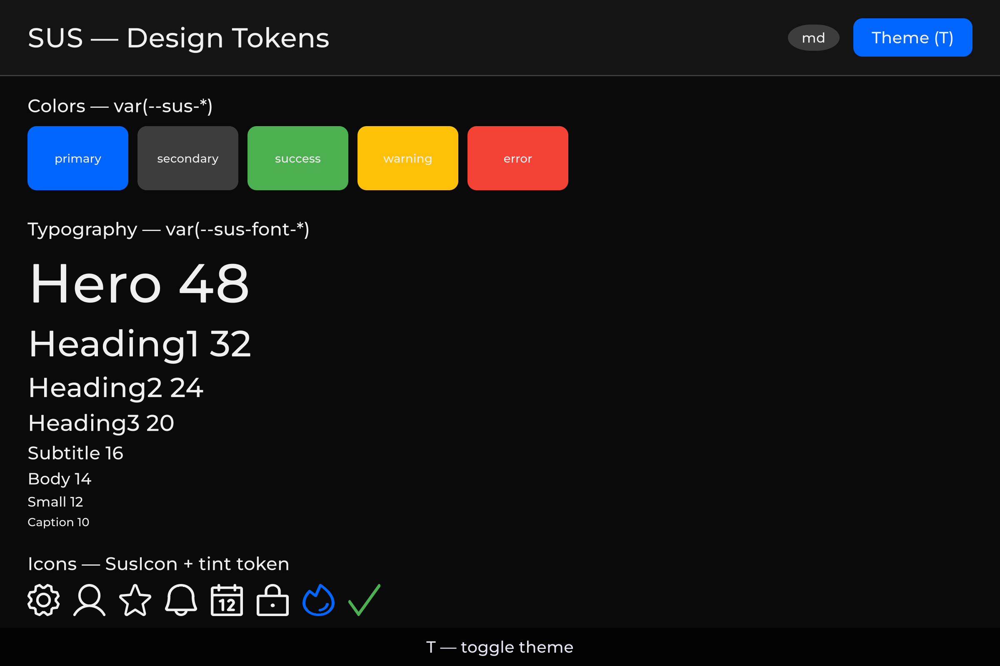
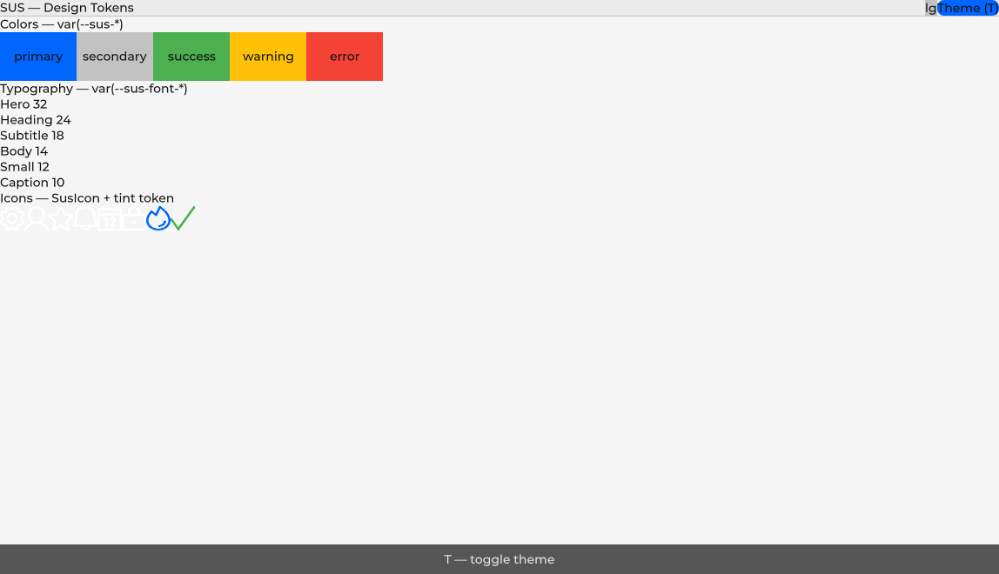
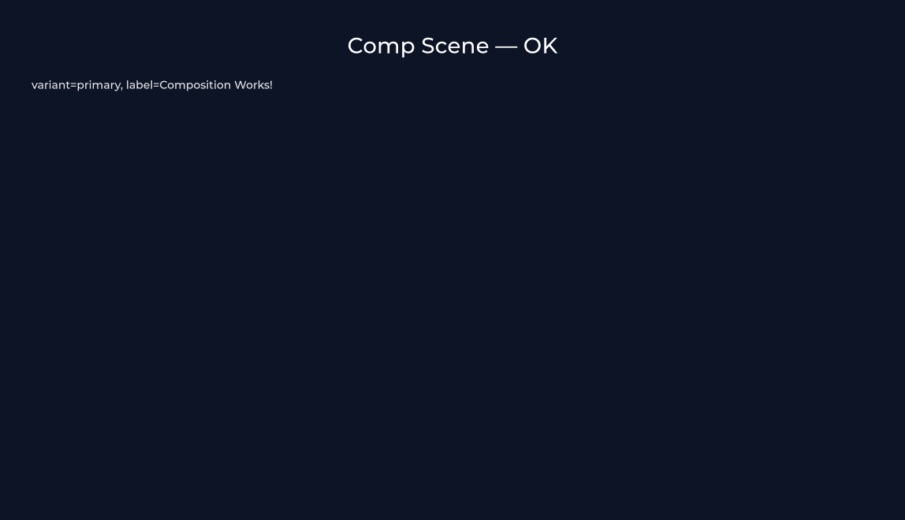

<p align="center">
  
</p>

<p align="center">
  
</p>

# Sharq UI System Core

**SusCore** — foundation of the SUS UI system. Vue-like single-file components for Unity UI Toolkit — reactivity, SFC compiler, directives, slots, scoped CSS, themes, breakpoints, world-space, console.

**License:** [MIT](./LICENSE.md)

**Community & support:** [support@sus-ui.dev](mailto:support@sus-ui.dev) · [Discord](https://discord.gg/gwS9nwqWWj) · [Telegram](https://t.me/sus_public)

**Tests & releases:** 378 automated tests · [CHANGELOG](./CHANGELOG.md) · [GitHub Releases](https://github.com/antaresdk/sus-core/releases) <!-- sus:ok -->

<!-- sus:gen ver pkg=sus-core -->
**Package:** `com.sharq-it.sus.core` (current version — `1.0.23`)
<!-- /sus:gen -->

---

## Requirements

<!-- sus:gen unity kind=min -->
- **Unity 6000.3** or newer
<!-- /sus:gen -->
- **UI Toolkit only** — this package does not target uGUI / Canvas
- **Editor-time compilation** — `.sharq` files compile in the Editor (`AssetPostprocessor`), not at runtime; builds ship ordinary generated C#

---

## Quick start

Write one `.sharq` file — template, script, style. The Editor compiles it to a normal `[UxmlElement] partial class` plus scoped USS:

```xml
<!-- Counter.sharq -->
<template>
  <ui:VisualElement $MainElement class="counter">
    <ui:Label :text="Count" class="counter__value" />
    <ui:Button text="+1" @click="OnInc" />
  </ui:VisualElement>
</template>

<script>
public Prop<int> Count = new(0);
private void OnInc() => Count.Value++;
</script>

<style>
.counter { flex-direction: row; align-items: center; }
.counter__value { font-size: 24px; margin-right: 12px; }
</style>
```

Mount it from a MonoBehaviour (after the `.sharq` has been generated):

```csharp
SusApp.Create(uiDocument)
    .UseTheme(SusTheme.Dark)
    .Mount<Counter>();
```

---

## Gallery

Samples from this package (ThemeShowcase + Comp) — design tokens and composition on raw UITK:

<table>
<tr>
<td><br><sub>ThemeShowcase — colors / typography / icons (Dark)</sub></td>
<td><br><sub>ThemeShowcase — same tokens (Light)</sub></td>
<td><br><sub>Comp — parent→child props on UITK</sub></td>
</tr>
</table>

---

## Restyle without editing C#

Appearance is a USS concern, not a C# concern. Semantic tokens (`--sus-*`) recolor the whole cascade at once; a project class overrides a single control; visual states are class toggles (`AddToClassList` / `RemoveFromClassList`), so they restyle with the same sheets. For controls that follow this policy you should not need to edit generated or hand-written C# to make the UI look like your game.

Inline UITK writes to appearance properties from C# (colors, fonts, radii, and similar) still win over any selector — a small known remainder of those call sites is being moved into USS. Prefer tokens and classes; treat `.style.<appearance> = …` in C# as a last resort, not the theming API. See [Design tokens](./Docs/DESIGN_TOKENS.md).

---

## Installation

<!-- sus:gen urls -->
```
https://github.com/antaresdk/sus-core.git#v1.0.23
```
<!-- /sus:gen -->

Configuration (`Assets/sus.config.json`):

```json
{
  "SharqDirectory": "Assets/SusUI",
  "GeneratedDirectory": "Assets/SusUI/Generated",
  "EnableValidation": true,
  "StrictVForKey": true,
  "LogGeneratedFiles": true,
  "HotReloadStatePreserve": true
}
```

**Public demo** (cloneable runtime example): [sus-demo-public](https://github.com/antaresdk/sus-demo-public)

---

## What is not included

- **Navigation** (routes, guards, nested screens, modal stack) lives in a **separate** sibling package — `sus-router`.
- **Ready-made widgets** (buttons, tables, dialogs, HUD elements) are **not** in this package. This is the framework layer; you build components on top of it or add a downstream UI package.
- Generated files live under the directory you configure (`Assets/SusUI/Generated` by default) and are meant to be regenerated, not hand-edited.

---

## Exit cost

The compiler emits ordinary C# and USS — a normal `[UxmlElement] partial class : SusComponent` you can read, step through in a debugger, and open in UI Builder. Those generated files stay in your project if you later remove this package.

---

## What's inside

| Subsystem | Files | Status |
|---|---|---|
| **Reactivity** | `Prop<T>`, `Computed<T>`, `ReactiveEffect`, `DependencyTracker` | ✅ |
| **Component Model** | `SusComponent`, `Watch()`, `WatchEffect()`, lifecycle hooks | ✅ |
| **Bindings** | `BindText`, `BindShow`, `BindVisibility`, `BindClass`, `BindList`, `BindModel` | ✅ |
| **Themes** | `SusThemeService` + `SusTheme` (`readonly struct`) + `.theme-*` classes | ✅ |
| **Colors (3 layers)** | `_palette.uss` (L1 `--base-*`), `_theme.uss` (L2 `--thm-*`), `design-tokens.uss` (L3 `--sus-*`) | ✅ |
| **Fonts** | `_font.uss` (Montserrat + override), `--sus-font-*` tokens | ✅ |
| **Icons** | Curated in-package subset; optional Phosphor sample for the long tail. `SusIconRegistry` / providers, `SusIconElement`, theme tint | ✅ |
| **Breakpoints** | `SusBreakpointService`, `Prop<Breakpoint>`, `.breakpoint-*` classes on root | ✅ |
| **OverlayHost** | Portal container, layers by `OverlayCategory`, z-order via DOM | ✅ |
| **World-space** | `WorldSpaceService` (separate world panel preferred; OverlayCategory.World fallback) | ✅ |
| **Console** | `SusConsoleService` + `SusConsoleDriver` (hotkey `~`, filter, search, Tab-completion) | ✅ |
| **Compiler** | Sharq SFC → C#, scoped CSS, validator, incremental compilation | ✅ |
| **Audit (Debug/QA)** | 21 modules + ScreenAudit (text screen dumps): ClickAudit, BoundsAudit, CallbackAudit, OverlayAudit, StateAudit, LifecycleAudit, NavigationAudit, PerformanceAudit, DebounceAudit, ClickTargetSizeAudit, StackDepthAudit, GuardAudit, ModalStackAudit, EmptyStateAudit, RemountLoopAudit, OverflowAudit, DeadRouteAudit, SusTable StateAudit, LayoutReentryAudit, IdleGuardAudit, FocusTrapAudit | ✅ |

## Place in the ecosystem

`sus-router` is a **sibling** package that depends on this one — not a folder inside it.

```
your Unity project
├── sus-core (this package) — reactivity, compiler, themes, overlays
└── sus-router — navigation (screens, modals, KeepAlive); depends on this package
```

## Documentation

- Package guides: [`Docs/README.md`](./Docs/README.md)
- Product site: [sus-ui.dev](https://sus-ui.dev)
